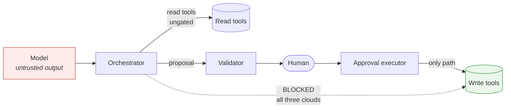

# Threat model — the write boundary

Each tree's `ARCHITECTURE.md` section 2 explains *how* its boundary is drawn. This document
takes the other view: given an adversary already inside, what do they reach, and which of the
three clouds still refuses?

It exists because "the boundary holds" is not a claim you can check. "A compromised
orchestrator cannot invoke a write tool on any of the three clouds, and here is why, and here
is the one case where that is false" is.

**Method.** Four adversaries, defined by capability rather than identity. For each: what they
hold, what they reach, and a per-cloud verdict. Everything asserted here is traceable to a file
in the repository; where the answer differs by cloud, it says so rather than averaging.

**The claim under test**, made three times in three clouds:

> A state-changing action cannot reach production without a human approving that specific
> action.

---

## 1 · Assets and trust boundaries

| Asset | Why it matters |
|---|---|
| Write tools (`process_refund`) | The only components that change state. Everything else is arrangement. |
| Approval records | Both the concurrency control and the audit trail. Corrupt them and approvals become replayable or deniable. |
| The approval executor's identity | The single principal permitted to invoke write tools on all three clouds. |
| Trace stream | The record that a write happened. Its absence is what makes an incident unreconstructable. |
| Read tools | Not gated. See §3 — this is the largest genuine gap. |



The trust boundary that matters is the dotted line. Every control in all three trees exists to
keep it dotted.

---

## 2 · Adversary A1 — a compromised orchestrator

**Capability.** Arbitrary code execution as the orchestrator identity. The strongest realistic
adversary short of cloud-admin: they hold a legitimate identity and can make any call it is
permitted to make.

**What they reach on every cloud.** All read tools, with arbitrary arguments. The proposal path
— they can submit any write proposal they like. What they cannot do is approve it.

**Per-cloud verdict:**

| | Mechanism | Holds? |
|---|---|---|
| **AWS** | Identity policy built from `read_tool_arns`; write tools' resource policy names `approval_executor_arn` | **Yes**, but note that for a same-account caller Lambda grants invocation if the identity policy allows it **or** the resource policy does. The two locks are both allow-shaped, so widening either one is sufficient to break it. |
| **Azure** | `app_role_assignment_required = true` on every tool service principal | **Yes, on one lock.** Easy Auth and output shape are *not* independent — with the Entra lock off, the orchestrator obtains a valid token for the write tool's own audience and Easy Auth accepts it. |
| **GCP** | Lock 1: `roles/run.invoker` to the executor only. Lock 2: an IAM **deny** policy on the orchestrator | **Yes, strongest.** A deny policy cannot be overridden by a later grant, so unlike AWS and Azure it survives an operator adding a broad project-level invoke role. |

**The asymmetry, stated plainly.** GCP is the only tree where the boundary survives a
subsequent well-meaning broad grant. Azure is the only tree where a single attribute flip makes
the split decorative while every diagram, output, and role assignment still looks correct.

---

## 3 · Adversary A2 — a prompt-injected model

**Capability.** The attacker controls the model's output — via a poisoned document, a
retrieved page, a crafted ticket — but has no code execution anywhere.

This is the adversary the architecture is really built for, and the honest result is more
interesting than "it is blocked."

**What they reach: everything the orchestrator may do, and nothing more.** Injection cannot
widen an IAM policy. So on the write path, A2 is strictly weaker than A1 and the §2 verdicts
all hold — the injected model can *propose* a write, and a human sees it.

**The boundary is not injection-proof; it is injection-surviving.** Injection converts into a
proposal that a human reads. That is the whole design, and it has two consequences worth
stating rather than glossing:

1. **The human is the control.** Nothing in any of the three trees defends against a reviewer
   approving a plausible-looking malicious write. Argument fingerprinting guarantees that what
   executes is what was shown — it guarantees nothing about whether what was shown should have
   been approved. Approval fatigue is therefore a security property of the deployment, not a UX
   concern, and this repository does not address it.

2. **Reads are not gated at all, on any cloud.** An injected model can call every read tool
   with arbitrary arguments. If those tools reach customer records, that is an exfiltration
   channel the write boundary neither sees nor constrains — the trace records it, which makes
   it detectable afterwards, not prevented.

**Verdict: all three clouds equal, and all three incomplete.** The write boundary is a control
on state change. It is not a data-exfiltration control and should not be described as one.

---

## 4 · Adversary A3 — a leaked or replayed approval claim

**Capability.** The attacker holds a valid approval artifact — a redelivered notification, a
captured callback, a re-clicked link.

**What it buys: at most one execution of the exact arguments a human already approved.**

The claim is a compare-and-set in all three trees, which is what makes replay collapse rather
than accumulate:

| Cloud | Primitive |
|---|---|
| AWS | DynamoDB conditional write — `attribute_exists(approval_id) AND (status = pending OR (status = executing AND claimed_at < stale))` |
| Azure | Cosmos ETag with `if_match` (`shared/cosmos_io.py`) |
| GCP | Firestore transaction |

Same invariant, three primitives. A double-clicked approve button, a redelivered queue message,
and a retried invocation all collapse into one execution.

**Two further limits on what a claim is worth:**

- **It cannot be retargeted.** The validator fingerprints the arguments the human was shown;
  the executor recomputes and compares before invoking. A claim for a €50 refund cannot be
  spent on a €50,000 one — the fingerprints differ and the task fails rather than executing
  something nobody approved.
- **It expires into reclaimable, not into open.** A claim stuck in `executing` becomes
  reclaimable after `STALE_CLAIM_SECONDS` (default 900). That is safe only because the write
  tool is idempotent on the approval ID. If a write tool is ever added that is *not*
  idempotent, this is the assumption that breaks, and it breaks silently.

**Verdict: equal across all three clouds.** This is the one adversary where the trees are
genuinely at parity.

---

## 5 · Adversary A4 — a Terraform change

**Capability.** Permission to merge a change to `infra/`. Malicious or, far more likely,
careless.

This is the adversary the repository actually spends its test budget on, because every mutation
below **passes `terraform validate`**, applies cleanly, and looks correct in the console.

| Cloud | Mutation | Why it is silent |
|---|---|---|
| AWS | `tool_function_arns` gets `tool_arns_by_name` instead of `read_tool_arns` | Reads as a simplification. Same-account invocation needs only the identity policy, so the resource policy never gets consulted. |
| AWS | Write permission names `states.amazonaws.com` | A valid principal in a valid attribute — the orchestrator's own. |
| AWS | `read_tool_arns` loses its `access == "read"` filter | The env roots trust that output; unfiltered, it is every tool. |
| Azure | `app_role_assignment_required = false` | One word in a file full of one-word settings. Azure Policy *cannot* guard it: Entra app registrations are Graph objects with no ARM representation. |
| GCP | `roles/cloudfunctions.invoker` instead of `roles/run.invoker` | A gen2 function is a Cloud Run service underneath. The wrong role grants nothing — silent in the safe direction for read tools, silent in the **dangerous** direction for write tools, which are then invokable by anyone holding `run.invoker` from any other grant. |
| GCP | `serviceAccount:` in a deny policy's principals | Deny policies take `principal://` form. The allow-policy form is accepted and matches nothing. |

**What catches these:** the static suites under `infra/*/tests/`, which read source rather than
plans and so need no credentials. Each has been mutation-tested — the mutations above were
verified to fail them.

**What does not catch these:** `terraform validate`, `terraform plan`, and code review by
anyone who does not already know the specific trap.

**Verdict: this is the most likely adversary and the best defended**, which is the correct
allocation. It is also the only one where the defense is a test rather than a cloud control.

---

## 6 · Which cloud survives what

| Adversary | AWS | Azure | GCP |
|---|---|---|---|
| A1 · Compromised orchestrator | Holds — two allow-shaped locks | Holds — **one** lock | Holds — allow **and** deny |
| A1 + a later broad invoke grant | **Fails** | **Fails** | **Holds** — deny wins |
| A2 · Prompt-injected model (write path) | Holds | Holds | Holds |
| A2 · Prompt-injected model (read path) | **No control** | **No control** | **No control** |
| A3 · Replayed approval claim | Holds | Holds | Holds |
| A4 · Careless Terraform change | Caught by tests | Caught by tests | Caught by tests |
| Cloud admin, out of band (§7) | Not defended | Detected — `modules/entra-audit` | Not defended |

The one row where the three genuinely differ is the second. Everything else is either parity or
a shared gap.

---

## 7 · Not defended, and deliberately so

Listing these is the point of the document. A threat model that only lists what is covered is
marketing.

- **A human approving a bad write.** No control anywhere in the three trees. See §3.
- **Read-side exfiltration.** Not gated on any cloud. Traced, not prevented.
- **Cloud-admin action outside Terraform.** Anyone who can edit IAM directly can undo any of
  this. Azure compensates with `modules/entra-audit` as a *detective* control, which is
  narrower than prevention and is described that way.
- **The model provider's own supply chain.** Out of scope entirely.
- **GCP: `roles/datastore.user` is project-scoped.** There is no way to grant tools access to
  the execution-state database without also granting it on the approvals database. The tree
  assumes one project per environment; that assumption is load-bearing and unenforced.
- **GCP: deny policies validate at apply time, not plan time.** A supported-but-wrong permission
  string applies cleanly and denies nothing. A control nobody has watched refuse is a
  hypothesis.
- **Non-idempotent write tools.** The stale-claim reclaim in §4 assumes idempotency on the
  approval ID. Nothing enforces it.

---

## 8 · Assumptions this rests on

1. One cloud project/account/subscription per environment.
2. Write tools are idempotent on the approval ID.
3. Approval records are retained. AWS has no TTL on the approvals table deliberately — the
   record is evidence. Azure's `approval_record_ttl_seconds` defaults to null for the same
   reason; setting it is a records-policy decision, and setting it shortens the audit trail.
4. Reviewers read what they approve.

Assumption 4 is the weakest and the least enforceable, and it is where a real deployment should
spend its next control.

---

## Verify

```bash
# The boundary suites, all three trees — the A4 defenses
python3 -m unittest discover -s infra/terraform-aws/tests
python3 -m unittest discover -s infra/terraform-azure/tests
python3 -m unittest discover -s infra/terraform-gcp/tests

# The claim primitives referenced in §4
grep -rn "ConditionExpression" infra/terraform-aws/src/approval_executor/executor.py
grep -rn "def claim" infra/terraform-azure/src/shared/cosmos_io.py
grep -rn "transaction" infra/terraform-gcp/src/approval_executor/main.py
```

Related: each tree's `ARCHITECTURE.md` section 2, [SECURITY.md](../SECURITY.md) for what to do
with a finding, and [security-checklist.md](security-checklist.md) for deployment-time controls
this document treats as out of scope.
