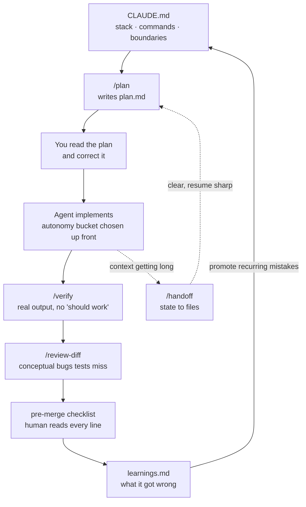

# How to use this folder

A complete walkthrough: what this kit is for, what every file does, how the pieces fit
together, and exactly what to do on day one.

If you read nothing else, read [The 15-minute version](#2-the-15-minute-version) and then
[Day one, step by step](#5-day-one-step-by-step).

---

## 1. What problem this solves

Most people use a coding agent like a smarter search engine: describe a problem in a chat
tab, get code back, paste it in, fix what is wrong. That works, and it plateaus almost
immediately. Every session starts from the same cold floor as the last one, and the ceiling
is however well you can describe a problem in one message.

This kit is for the other mode: the agent runs **inside your repo**, with your filesystem,
your shell, and a loop. It reads the real file instead of the snippet you pasted, runs the
real test instead of predicting the result, and iterates on the actual failure.

The shift is not prompt tricks. It is five unglamorous things:

| | The thing | What it prevents |
|---|---|---|
| 1 | **Clear rules** | The agent inventing a second HTTP client because nobody told it one exists |
| 2 | **Small scopes** | A "quick refactor" quietly touching auth |
| 3 | **Clean context** | Output degrading mid-session and getting blamed on the model |
| 4 | **Verification commands** | "Should work" shipping to main |
| 5 | **Review checkpoints** | A subtle conceptual bug passing every green test |

Tell the agent where to look, what not to touch, how to prove success, and when to stop.
That is the whole thesis. Everything in this folder is a concrete artifact for one of
those five.

### Who this is for

- Anyone using a coding agent daily who feels stuck at the same level they hit in week one
- Anyone about to roll agents out to a team and wanting guardrails before habits set
- Anyone in a governed environment (finance, health, government) who needs the practice to
  survive contact with model-risk and change-management review

### What this is not

It is not a prompt library, and it is not framework-specific. Nothing here is tied to a
particular agent product — the file conventions (`CLAUDE.md`, `.claude/`) are Claude Code's,
but the habits transfer to any agent with filesystem and shell access.

---

## 2. The 15-minute version

From the root of the repo you want to instrument:

```bash
PLAYBOOK=path/to/docs/agentic-coding-playbook

cp $PLAYBOOK/templates/root/CLAUDE.md            ./CLAUDE.md
mkdir -p .claude/rules .claude/commands
cp $PLAYBOOK/templates/.claude/rules/*.md        .claude/rules/
cp $PLAYBOOK/templates/.claude/commands/*.md     .claude/commands/
cp $PLAYBOOK/worksheets/learnings.md             ./learnings.md
```

Then three things, in this order, and the third is not optional:

1. **Fill in the Commands section of `CLAUDE.md`** — install, test, lint, typecheck, build.
   Every one must actually run right now on a clean checkout. If the agent cannot run your
   tests, it cannot verify its own work, and every other habit collapses back into
   "should work."
2. **Delete every line of `CLAUDE.md` you are not willing to enforce.** The test for a
   line: *would you correct the agent if it violated this?* If not, it is a wish, not a
   rule. A short file that is all real rules beats a long file where the real rules are
   buried.
3. **Delete `templates/.claude/rules/example-scoped-rule.md`** from your copy, or rewrite
   it for a real subtree of yours. It is a payments example — shipping it unedited teaches
   the agent rules about a module you do not have.

Then run one real task plan-first using [checklists/task-start.md](checklists/task-start.md).

---

## 3. What every file in here does

### Read these (the reasoning)

| File | What it is | When to read it |
|---|---|---|
| [README.md](README.md) | The one-page overview and quick start | First |
| [PLAYBOOK.md](PLAYBOOK.md) | **The core document.** Eight habits in dependency order, each with the reasoning behind it | First real read, ~15 min |
| [TWO-WEEK-RAMP.md](TWO-WEEK-RAMP.md) | Day-by-day adoption plan — what to do on day 1, day 2, and so on | When you have decided to actually do this |
| [TEAM-WORKFLOW.md](TEAM-WORKFLOW.md) | Multiple people in one repo — the shared/personal file split, gitignore, conflicts, onboarding | Before a second person starts using this kit |
| [ANTIPATTERNS.md](ANTIPATTERNS.md) | Failure modes named so you recognize them live | After your first week, or when something feels wrong |
| [GLOSSARY.md](GLOSSARY.md) | Rules vs. commands vs. skills vs. subagents vs. MCP — what each is and when to reach for it | When you are unsure which artifact a need calls for |
| [ENTERPRISE-ADAPTATION.md](ENTERPRISE-ADAPTATION.md) | What changes under governance — tool access, data egress, model provenance | Before rolling out at a bank, hospital, or agency |
| [REFERENCES.md](REFERENCES.md) | Source material and further reading | When you want the primary sources |

### Copy these (the artifacts)

Everything under `templates/` is meant to be copied into a real repo and edited. They are
starting points, not drop-in-and-forget files.

| Template | Copy to | What it does |
|---|---|---|
| [templates/root/CLAUDE.md](templates/root/CLAUDE.md) | `./CLAUDE.md` | The project context the agent cannot infer: stack, commands, layout, conventions, boundaries, autonomy, gotchas |
| [templates/.claude/rules/verification.md](templates/.claude/rules/verification.md) | `.claude/rules/` | Definition of done, evidence-over-assertion, and the forbidden list of ways to fake a green check |
| [templates/.claude/rules/autonomy.md](templates/.claude/rules/autonomy.md) | `.claude/rules/` | Green/Yellow/Red buckets and a decision procedure for when the bucket is not obvious |
| [templates/.claude/rules/example-scoped-rule.md](templates/.claude/rules/example-scoped-rule.md) | `.claude/rules/` **(rewrite first)** | A worked example of a path-scoped domain rule — payments invariants. Rewrite for your domain or delete |
| [templates/.claude/commands/plan.md](templates/.claude/commands/plan.md) | `.claude/commands/` | `/plan` — investigate, write `plan.md`, stop before writing code |
| [templates/.claude/commands/verify.md](templates/.claude/commands/verify.md) | `.claude/commands/` | `/verify` — run every check, report real output in a table, no fixing |
| [templates/.claude/commands/review-diff.md](templates/.claude/commands/review-diff.md) | `.claude/commands/` | `/review-diff` — hunt conceptual bugs that pass lint, types, and tests |
| [templates/.claude/commands/handoff.md](templates/.claude/commands/handoff.md) | `.claude/commands/` | `/handoff` — dump session state to files so a fresh context resumes instead of restarting |
| [templates/.claude/skills/example-skill/SKILL.md](templates/.claude/skills/example-skill/SKILL.md) | `.claude/skills/<name>/` | Template for a skill — domain knowledge loaded on demand |
| [templates/.claude/agents/example-feature-agent.md](templates/.claude/agents/example-feature-agent.md) | `.claude/agents/` | Template for a feature-scoped subagent, with the reasoning for why feature-specific beats role-generic |

### Run these (the checklists)

Human checklists. Read before or after an agent session, not by the agent.

| Checklist | When |
|---|---|
| [checklists/task-start.md](checklists/task-start.md) | The 30 seconds before you type the prompt. Most bad sessions are decided here |
| [checklists/pre-merge.md](checklists/pre-merge.md) | Before agent-assisted work becomes someone else's problem |
| [checklists/context-hygiene.md](checklists/context-hygiene.md) | When output quality drops mid-session and you are about to blame the model |

### Fill these (the worksheets)

Living state files that live **in your repo root**, not in this folder. They exist so state
survives a context clear.

| Worksheet | Copy to | Holds |
|---|---|---|
| [worksheets/plan.md](worksheets/plan.md) | `./plan.md` | Goal, autonomy bucket, files to change, approach, acceptance criteria, out of scope, risks, rollback |
| [worksheets/context.md](worksheets/context.md) | `./context.md` | Decisions and *why*, constraints discovered, dead ends, open questions, environment notes |
| [worksheets/tasks.md](worksheets/tasks.md) | `./tasks.md` | Next action, in progress, blocked, done, deliberately-not-doing |
| [worksheets/learnings.md](worksheets/learnings.md) | `./learnings.md` | Every mistake the agent made, and which rules file it should be promoted into |

**If anyone else works in this repo, read [TEAM-WORKFLOW.md](TEAM-WORKFLOW.md) before
copying these.** The first three are per-task personal state and should be gitignored —
committed to a shared repo they conflict on nearly every merge. `learnings.md` is worth
sharing but needs a per-person layout, because an append-only file collides every time two
people write to it in the same week.

---

## 4. How the pieces fit together

The artifacts are not a menu of independent good ideas. They form a loop, and the loop is
the point.



Two edges matter more than the boxes:

**`learnings.md` → `CLAUDE.md`.** This is what makes the system compound. Without it you
correct the same three mistakes forever and are no faster in month six than in week one.
Each mistake should be paid for exactly once. The weekly promotion review in
[worksheets/learnings.md](worksheets/learnings.md) takes five minutes.

**`/handoff` → clear → resume.** Context is a consumable. When it gets long or polluted,
dumping state to files and starting fresh is a ten-second fix for a problem people
routinely spend an hour fighting.

### Which artifact for which need

From [GLOSSARY.md](GLOSSARY.md), the escalation ladder — this is the single most common
point of confusion:

| You have | Make it a | Why | Lives in |
|---|---|---|---|
| Prompted the same thing twice | **Command** | A reusable prompt you invoke by name | `.claude/commands/*.md` |
| Domain knowledge it keeps needing | **Skill** | Reference material loaded on demand — only the description stays in context | `.claude/skills/*/SKILL.md` |
| Work that floods your main context | **Subagent** | Separate context, reports back only the conclusion | `.claude/agents/*.md` |
| An external system it should reach | **MCP server** | A tool connection | MCP config |
| A rule that applies to one subtree | **Scoped rule** | Loads only when that path is in play | `.claude/rules/*.md` |
| A rule that applies always | **`CLAUDE.md` line** | Always loaded — so keep it under ~200 lines | `./CLAUDE.md` |

The rule of thumb for the last two: if it applies to under half the repo, it belongs in a
scoped rule, not `CLAUDE.md`. `CLAUDE.md` is paid for on every single turn, forever.

---

## 5. Day one, step by step

Roughly an hour, and it is the hour that makes the rest work.

### Step 1 — Pick one repo (5 min)

Pick a real one you work in weekly. Not a toy. The habits only stick if the stakes are
real, and a toy repo will not surface the boundary and verification problems that make
this worth doing.

### Step 2 — Write `CLAUDE.md` (20 min)

Copy [templates/root/CLAUDE.md](templates/root/CLAUDE.md) to your repo root and fill it in.

Priority order, because you will not finish all of it:

1. **Commands** — install, test, test-one, lint, typecheck, build. Verify each one actually
   runs. This is the section everything else depends on.
2. **Boundaries** — the real paths nobody should touch without asking. Migrations, infra,
   CI config, secrets, auth. Be specific; vague boundaries are not boundaries.
3. **Stack and layout** — only the non-obvious parts. Not a full file tree.
4. **Conventions** — three real ones you enforce in review beat twenty aspirational ones.

Then delete everything you did not fill in. An unfilled template section is worse than no
section, because it teaches the agent that the rules here are decorative.

**Target: under 200 lines.** If you are over, push detail into `.claude/rules/`.

### Step 3 — Add the rules and commands (10 min)

```bash
mkdir -p .claude/rules .claude/commands
cp $PLAYBOOK/templates/.claude/rules/verification.md .claude/rules/
cp $PLAYBOOK/templates/.claude/rules/autonomy.md     .claude/rules/
cp $PLAYBOOK/templates/.claude/commands/*.md         .claude/commands/
```

`verification.md` and `autonomy.md` are usable nearly as-is — they are generic by design.
Skim them and adjust anything that does not match how your team works.

Do **not** copy `example-scoped-rule.md` unedited. Either rewrite it for a real subtree of
yours (the payments example shows the shape: invariants, required patterns, testing
requirements, autonomy bucket) or leave it behind.

### Step 4 — Make sure verification actually runs (10 min)

Run your test command on a clean checkout. If it fails, is flaky, or needs undocumented
setup, **fix that first**. This is not a detour — it is the highest-value thing you can do
today.

An agent with a working test command can iterate to correct on its own. An agent without
one can only produce plausible-looking code and tell you it should work. Everything in
this playbook is downstream of that difference.

### Step 5 — Run one task plan-first (15 min)

Pick something small and real. Then:

1. Run through [checklists/task-start.md](checklists/task-start.md) — thirty seconds
2. Invoke `/plan <your task>` — it investigates and writes `plan.md`, then stops
3. **Actually read the plan.** Do not skim and approve. This is where you discover you and
   the agent disagree about what the task is, and it costs minutes here versus hours later
4. Correct the plan, then let it implement
5. Run `/verify` and read the real output
6. Run `/review-diff` before you merge

Notice what step 3 caught. That is usually the moment the value of this becomes concrete.

---

## 6. What to do in week two

Day one gets you rules and verification. Week two is where compounding starts. Full detail
is in [TWO-WEEK-RAMP.md](TWO-WEEK-RAMP.md); the short version:

- **Write two commands** for things you have now prompted twice. Anything you have typed
  twice should be a file.
- **Write one skill** for domain knowledge the agent keeps needing and cannot infer.
- **Write one feature-scoped subagent** — scoped to one real feature of yours, with your
  real paths and fixtures named in it. Not a "QA engineer" agent; see the reasoning in
  [templates/.claude/agents/example-feature-agent.md](templates/.claude/agents/example-feature-agent.md).
- **Start `learnings.md`** and do one promotion review at the end of the week.

Then look past code. The largest reported wins have come from people automating workflows
nobody had classified as engineering — incident runbooks, report generation, data pulls,
onboarding checklists. Look for the repetitive, rule-shaped work in your own week.

---

## 7. Common mistakes when adopting this

| Mistake | Why it fails | Fix |
|---|---|---|
| Copying all templates unedited | The example rules describe a payments module you do not have. The agent follows rules about imaginary code | Fill in or delete. Every line should be true of *your* repo |
| Writing a 400-line `CLAUDE.md` | Real rules get buried among speculative ones and the model weighs them roughly equally, so it reliably follows none | Cap at ~200 lines. Push the rest into scoped rules |
| Skipping to commands and subagents | Habits 6–7 automate a loop that habit 4 has not verified. You get faster at shipping unverified work | Verification first. Always |
| Adopting the checklists but not `learnings.md` | You catch mistakes but never prevent them recurring. No compounding | Five-minute weekly promotion review |
| Auto-accepting everywhere because it went well | The failure mode is a subtle bug in Red-bucket code that passes tests encoding the same misunderstanding | Pick the bucket before starting, per task |
| Treating `plan.md` as a formality | Approving a plan you skimmed gives you the cost of planning with none of the benefit | Read it properly. It is the cheapest place to catch a disagreement |

For the full set with diagnosis and recovery, see [ANTIPATTERNS.md](ANTIPATTERNS.md).

---

## 8. Adapting this to a governed environment

If you are in a bank, hospital, or public agency, the habits transfer cleanly but the
mechanics do not. Tool access, data egress, and model provenance are governed, and the
"point it at prod and let it run" parts need to route through your model-risk and
change-management process.

[ENTERPRISE-ADAPTATION.md](ENTERPRISE-ADAPTATION.md) covers this in full. The one thing
worth doing early: ask about the approval path in your **first week** on a team, rather
than discovering it after you have built a workflow that cannot be approved.

---

## 9. Reading order, by situation

**Never used an agent beyond a chat tab**
[PLAYBOOK.md](PLAYBOOK.md) → [TWO-WEEK-RAMP.md](TWO-WEEK-RAMP.md) → copy the templates →
day one above.

**Using agents daily and plateauing**
Skip to [habit 6 in PLAYBOOK.md](PLAYBOOK.md#6-anything-youve-prompted-twice-becomes-an-artifact),
then [ANTIPATTERNS.md](ANTIPATTERNS.md). The plateau is almost always "never got past
habit 1" — still hand-typing good prompts, never turning them into artifacts.

**Something feels wrong mid-session and you cannot name it**
[checklists/context-hygiene.md](checklists/context-hygiene.md). If output quality dropped,
the first hypothesis should be "my context is polluted," not "the model is having a bad
day." The first is true far more often and has a ten-second fix.

**Rolling out to a team**
[TEAM-WORKFLOW.md](TEAM-WORKFLOW.md) → [PLAYBOOK.md](PLAYBOOK.md) → standardize the
templates as your team's starting point. Add
[ENTERPRISE-ADAPTATION.md](ENTERPRISE-ADAPTATION.md) if you are in a governed environment.

**Unsure whether something should be a rule, command, skill, or subagent**
[GLOSSARY.md](GLOSSARY.md), or the ladder table in
[section 4](#which-artifact-for-which-need) above.

---

## 10. The one-paragraph summary

Make an agentic surface your default instead of a chat tab. Give it thin, deliberate
context in a `CLAUDE.md` you would actually enforce. Plan to a file and read the plan before
any code is written. Wire in a verification signal the agent can iterate against without
you — this is the habit everything else depends on. Choose autonomy per task rather than
globally. Turn anything you have prompted twice into an artifact. Keep sessions clean and
single-purpose. And keep your own judgment in the loop, because the bugs that survive
automated checks are precisely the conceptual ones a human review catches and the model
does not.
