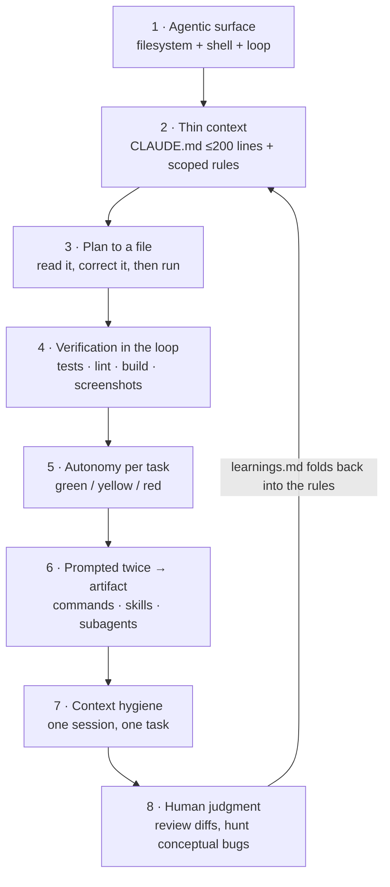

# The Eight Habits

In the order you should build them. Each habit assumes the ones above it. Skipping ahead is
the most common reason people plateau — habits 6 and 7 do almost nothing for you if habit 4
is missing, because you end up automating an unverified loop.

New here? [HOW-TO-USE.md](HOW-TO-USE.md) explains what every file in this folder does and
gives you a step-by-step day one. Sharing the repo with other people, or pointing an agent
at untrusted input? [TEAM-WORKFLOW.md](TEAM-WORKFLOW.md) and
[AGENT-SECURITY.md](AGENT-SECURITY.md) cover what these eight habits assume away.

---

## 1. Make an agentic surface your default, not chat

A coding-agent CLI beats a chat window for one structural reason: it has your filesystem,
your shell, and a loop. It can read the actual file instead of the snippet you pasted, run
the test instead of predicting the result, and iterate on the failure instead of handing
you a guess.

If you are still copy-pasting code into a browser tab, everything below is moot. That is
the single change with the largest effect, and it is a habit change rather than a skill.

**The non-obvious part:** the highest-value uses often are not coding. Inside Anthropic the
surprising ones were lawyers building phone-tree systems, marketers generating hundreds of
ad variations, and data scientists building visualizations without knowing JavaScript. The
common thread is a repetitive, rule-shaped workflow that nobody had classified as
engineering. Look for those in your own week.

**Do this now:** pick the next task you would have pasted into a chat tab, and run it in the
agent instead. Notice specifically what it does that the chat could not.

---

## 2. Engineer context deliberately, and keep it thin

A `CLAUDE.md` gives the agent the project context it cannot infer: your stack, your
conventions, your test command, what is off-limits. It is read from several places, and
they compose:

| Location | Scope | Use for |
| --- | --- | --- |
| Org / enterprise settings | Everyone in the org | Compliance and security constraints |
| `~/.claude/CLAUDE.md` | You, all projects | Your personal preferences |
| `./CLAUDE.md` (project root) | This repo | Stack, commands, conventions, boundaries |
| `./sub/dir/CLAUDE.md` | That subtree | Rules specific to that area |

**Short beats long.** The common failure is a 300-line kitchen sink where three real rules
sit buried under forty speculative ones. The model weighs them all roughly equally, so
burying the rules that matter means it follows none of them reliably.

Practical shape:

- Cap `CLAUDE.md` around **200 lines**.
- Push domain rules into `.claude/rules/*.md` scoped with path globs, so they load only
  when relevant.
- Load everything else just-in-time — let the agent read the doc when it needs it, rather
  than paying for it in every single turn.

**The test for whether a line belongs:** would you correct the agent if it violated this?
If not, it is not a rule, it is a wish. Delete it.

Start from [templates/root/CLAUDE.md](templates/root/CLAUDE.md).

---

## 3. Plan first, execute second

Write the plan to a file, read it yourself, correct it, then let it run.

The economics are lopsided and that is the whole argument: it is cheap to fix a wrong plan
and expensive to unwind 400 lines of wrong implementation. A plan is also the cheapest place
to discover that you and the agent disagree about what the task even is.

Persist task state **outside the conversation**, in files:

| File | Holds |
| --- | --- |
| `plan.md` | The approach, the steps, the acceptance criteria |
| `context.md` | Decisions made, constraints discovered, why things are the way they are |
| `tasks.md` | What is done, in progress, and blocked |

Update them before context gets compacted or cleared. That way a fresh session picks up
where the last one stopped instead of relearning the problem — the difference between
resuming and restarting.

Scaffolds: [worksheets/](worksheets/).

---

## 4. Build verification into the loop — never accept "should work"

**This is the single highest-leverage habit.** Everything else is optimization around it.

Give the model an objective signal it can iterate against without you:

- a test suite
- a linter or type checker
- a build
- a screenshot diff
- a one-off script that asserts the specific output you care about

The rule is *evidence-based completion*: actual build output, test results, or screenshots
before anything is marked done. "It should work" is not a result. If the agent cannot show
you the passing output, treat the task as in progress.

**The layered version.** Mature setups run deterministic verifiers first — tests, lint,
build, all cheap and unambiguous — and then an LLM judge on top for the things a test cannot
express ("is this actually solving the reported problem?"). Reported experience with this
pattern at scale: the judge layer vetoes roughly a quarter of sessions that already passed
the deterministic checks. Those are sessions that would otherwise have become review burden.

**One cheap prompt addition that pays for itself:** instruct it to *fix the root cause
rather than suppress the error*. Without it, a failing test has an easy local minimum — a
bare `except:`, a widened type, a hardcoded fallback value that makes the assertion pass.
Those changes look green and are worse than the bug.

Copy the ready-made rule: [templates/.claude/rules/verification.md](templates/.claude/rules/verification.md).

---

## 5. Calibrate autonomy per task, not globally

Autonomy is a per-task decision, and you should make it *before* you start rather than
discover it mid-review.

The Claude Code team's own working pattern is the model here: peripheral features run in
auto-accept loops to roughly an eighty-percent solution, while core logic is watched
closely. Same tool, same person, two completely different levels of supervision, chosen by
what the code touches.

A workable split:

| Bucket | Examples | Mode |
| --- | --- | --- |
| **Green** — peripheral, reversible, well-tested | Tests, docs, scaffolding, refactors under green tests, log lines, config in dev | Auto-accept, review the diff at the end |
| **Yellow** — real logic, contained blast radius | Feature code, internal APIs, data transforms | Plan first, review each significant edit |
| **Red** — core, security, money, data, irreversible | Auth, permissions, payments, migrations, deletes, prod config, crypto | Step-by-step, you read every line, no auto-accept |

Auto-accepting on core auth logic is how you ship a subtle bug — one that passes every test
because the test encodes the same misunderstanding.

Full version with a decision procedure: [templates/.claude/rules/autonomy.md](templates/.claude/rules/autonomy.md).

---

## 6. Anything you've prompted twice becomes an artifact

This is where compounding starts, and it is where most people stop. They get comfortable at
habit 1, keep typing good prompts by hand forever, and plateau — every session starts from
the same cold floor as the last one.

The escalation ladder:

| You have | Make it a | Which is | Lives in |
| --- | --- | --- | --- |
| Prompted the same thing twice | **Command** | A reusable prompt you invoke by name | `.claude/commands/*.md` |
| Domain knowledge the agent keeps needing | **Skill** | Reference material loaded on demand | `.claude/skills/*/SKILL.md` |
| Work that would pollute your main context | **Subagent** | A separate context that reports back a result | `.claude/agents/*.md` |
| An external system it should reach | **MCP server** | A tool connection | MCP config |

**Boris Cherny's rule of thumb on subagents:** feature-specific agents beat generic ones.
A "QA engineer" or "backend engineer" agent sounds reusable and underperforms, because the
description is too vague to drive good tool selection. An agent scoped to *your* checkout
flow, with *your* fixtures and *your* commands named in it, picks better tools and carries
tighter context.

Starting points: [templates/.claude/commands/](templates/.claude/commands/),
[templates/.claude/skills/](templates/.claude/skills/),
[templates/.claude/agents/](templates/.claude/agents/).

---

## 7. Practice context hygiene

Two failure modes, named so you can catch them while they are happening rather than after.

**The kitchen-sink session.** You debug a flaky test, then pivot to a UI change, then ask
about deployment, all in one context. The earlier material is still there, still being
attended to, and it distorts later reasoning. It reliably gets misread as "the model is
getting dumber today." It is not — the context is polluted. One session, one task.

**Correcting in circles.** Attempt fails, you correct, it fails differently, you correct
again. Every failed attempt stays in context, and the model is now reasoning in a
neighborhood defined by four wrong approaches. Progress asymptotes.

> The exit is the same move both times: **dump progress to a file, clear the context, restart
> with a sharper prompt** that includes what you learned and excludes the flailing.

If you have corrected the same thing twice, stop correcting. Write down what it keeps
getting wrong, clear, and re-enter with that written into the prompt or the rules file.

Checklist: [checklists/context-hygiene.md](checklists/context-hygiene.md).

---

## 8. Keep your own judgment in the loop

The honest counterpoint to all of the above.

AI-generated code skews "dirty" — unnecessary loops, redundant branches, conceptual errors
that pass type checks cleanly. The bug taxonomy has shifted: fewer syntax-level and
mechanical bugs, more subtle conceptual ones. That shift is not neutral, because the bugs
that remain are the expensive kind and they do not announce themselves at compile time.

Frontier models score in the low-to-mid 80s on realistic engineering benchmarks. Read the
remainder carefully: the unsolved fraction trends toward exactly the bug a human review
catches and an automated check does not. That fraction is where your attention belongs.

Practical consequences:

- **Review diffs, not summaries.** The summary is generated by the same process that wrote
  the code, and it will describe the intent rather than the artifact.
- **Be most suspicious of code that passed on the first try** in a Red-bucket area.
- **Ask "what does this do when the input is empty / duplicated / hostile?"** — conceptual
  bugs surface at the edges, and the happy path is exactly what got tested.
- **Keep a `learnings.md`.** Every time it gets something wrong, write it down, then fold
  the fix back into your rules files. That is how habit 8 feeds habit 2 and the loop
  compounds instead of repeating.

---

## The loop, drawn

The feedback edge is the point. Without it you have a checklist; with it you have a system
that gets better every week without you thinking about it.
