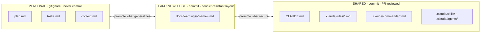

# Team workflow

How multiple people use this kit in one shared repository without fighting each other in
git.

Everything else in this folder is written as if one person is working alone. That
assumption breaks the moment a second person joins, and it breaks in a specific,
predictable way: **the kit tells you to create files at your repo root, and half of them
are personal scratch state that should never be committed.**

This document resolves that.

---

## 1. The one distinction that matters

Every file this kit produces falls into exactly one of three categories. Get this split
right and the rest is ordinary git.



### Shared — commit these, review them like code

`CLAUDE.md`, `.claude/rules/`, `.claude/commands/`, `.claude/skills/`, `.claude/agents/`

These define how the agent behaves for **everyone**. They are as much a part of your
codebase as a linter config, and they deserve the same treatment: a PR, a reviewer, and a
reason in the commit message.

A rule change that lands without review has the same blast radius as a lint rule change —
it silently alters what every teammate's agent does on every task.

### Personal — gitignore these, never commit

`plan.md`, `tasks.md`, `context.md`

These hold **your current session's state**. Two people working on different tasks will
have completely different content in the same filename, and every merge becomes a
conflict in a file whose contents nobody needs to preserve.

Add to `.gitignore`:

```gitignore
# Agent session state — personal, per-task, not shared
/plan.md
/tasks.md
/context.md
```

> **Why not commit them?** They are a scratchpad, not a record. Their whole purpose is to
> survive a context clear *for you*, today. Their value is measured in hours. Committing
> them means permanent merge conflicts in exchange for preserving something nobody reads
> next week.

### Team knowledge — commit, but restructure first

`learnings.md`

This one is genuinely valuable to share — it is the file that makes the whole system
compound — but the layout the kit ships is the **worst possible shape** for concurrent
editing: append-only, newest at the top, so every teammate writes to line 1 and every
merge conflicts.

Fix it by giving each person their own file:

```
docs/learnings/
├── README.md          # how promotion works, links to everyone's file
├── somesh.md
├── priya.md
└── marcus.md
```

Now appends never collide, and the weekly promotion review reads all of them.

If you would rather keep one file, the alternative is a `learnings/` directory of
timestamped entries (`2026-08-06-http-client.md`) — one file per learning, so two people
never touch the same file. Slightly more ceremony, zero conflicts.

---

## 2. Setting it up for a team

One person does this once, in a PR.

### Step 1 — Commit the shared config

```bash
git checkout -b chore/agent-config

# Shared — these get committed
git add CLAUDE.md .claude/rules/ .claude/commands/
git commit -m "Add agent config: project context, verification and autonomy rules"
```

### Step 2 — Gitignore the personal state

```bash
cat >> .gitignore <<'EOF'

# Agent session state — personal, per-task, not shared
/plan.md
/tasks.md
/context.md
EOF

git add .gitignore
git commit -m "Ignore per-session agent state files"
```

### Step 3 — Set up shared learnings

```bash
mkdir -p docs/learnings
cp docs/agentic-coding-playbook/worksheets/learnings.md docs/learnings/<your-name>.md
git add docs/learnings/
git commit -m "Add per-person learnings files"
```

### Step 4 — Open the PR and get it reviewed

Treat this like any config change. The reviewer is checking:

- [ ] Every command in `CLAUDE.md` actually runs on a clean checkout
- [ ] The Boundaries section names **real paths** in this repo
- [ ] No rule that the team would not actually enforce in review
- [ ] `CLAUDE.md` is under ~200 lines
- [ ] Nothing personal or machine-specific leaked in (local paths, your name, your API keys)

That last one matters. `CLAUDE.md` is committed and public to the team — it is not the
place for `/Users/somesh/...` paths or anything you would not put in a README.

---

## 3. Day-to-day: the normal loop

Once set up, agent work is just ordinary git work. The agent does not change your
branching model.

```bash
git pull --rebase origin main       # start current
git checkout -b feat/thing

# ... agent session: /plan, implement, /verify, /review-diff ...

git add -A                          # plan.md etc. are gitignored, so they stay out
git commit -m "..."
git push -u origin feat/thing
# open PR
```

**Three habits that prevent most trouble:**

**Pull before you plan, not after.** A plan written against three-day-old `main` plans
around code that no longer exists. `git pull --rebase` first, *then* `/plan`.

**One branch, one task — matching one session, one context.** The kit already tells you
to keep sessions single-purpose ([context-hygiene](checklists/context-hygiene.md)). That
maps exactly onto one branch per task. When you clear context, you are usually also done
with the branch.

**Never let the agent run git operations that touch the remote.** Push, force-push,
branch deletion, and history rewriting are human decisions. A useful line in `CLAUDE.md`:

```markdown
## Boundaries
- Never run `git push`, `git rebase`, `git reset --hard`, or any history-rewriting
  command. Stage and commit locally if asked; pushing is always the human's call.
```

---

## 4. Handling conflicts in the shared files

### `CLAUDE.md` — the common one

Two people add a Conventions line in the same week. Ordinary text conflict; resolve by
hand, keeping both if both are real rules.

**Prevention:** keep it thin. Most `CLAUDE.md` conflicts happen because the file has grown
into a 400-line kitchen sink that everyone edits constantly. A 150-line file that only
changes when a real rule changes conflicts a few times a year.

**When both sides added a rule about the same thing:** that is a signal, not a conflict.
Two people independently hit the same gap. Resolve it in the PR discussion, write one rule
that covers both cases, and note it — it usually means the underlying issue deserves a
scoped rule rather than a `CLAUDE.md` line.

### `.claude/rules/*.md` — rarer, higher stakes

Scoped rules conflict less because they are partitioned by path. When they do conflict,
the resolution needs someone who knows that domain — a payments rule conflict is resolved
by whoever owns payments, not by whoever pushed last.

**Prevention:** one rules file per subtree, named for the subtree (`payments.md`,
`checkout.md`). Never one giant `rules.md`.

### `.claude/commands/*.md` — should rarely conflict

If two people are editing the same command file simultaneously, usually one of them wants
a *variant* rather than an edit. Variants are cheap — `/verify` and `/verify-integration`
can both exist.

### `learnings.md` — solved structurally, not by resolving

If you followed §1 and split by person, this never conflicts. If you did not, you will hit
a conflict at line 1 roughly every time two people append in the same week. Go split it.

---

## 5. Keeping rules in sync across the team

The failure mode here is quiet: someone updates a rule, nobody else notices, and for two
weeks half the team's agents behave differently from the other half's.

**Announce rule changes like you announce lint changes.** A line in the team channel when
a rules PR merges. It takes ten seconds and prevents "why did the agent suddenly start
doing X."

**Pull before starting significant work.** Stale rules are worse than no rules, because
the agent confidently applies a convention the team has abandoned.

**Run the promotion review as a team ritual, not solo.** The kit's weekly promotion review
([worksheets/learnings.md](worksheets/learnings.md)) works better with three people than
one — mistakes that look like one-offs individually turn out to be patterns collectively.
Fifteen minutes, once a week, reading everyone's learnings file and deciding what gets
promoted into shared rules.

**Date rules that encode a temporary state.** `<!-- 2026-08: remove when legacy/ is
deleted -->` prevents a rule outliving its reason. Stale rules cost exactly as much
context as good ones and actively mislead.

---

## 6. Onboarding someone new

New teammate, day one. The config is already in the repo, so most of it is automatic.

```bash
git clone <repo> && cd <repo>
```

Then, in order:

1. **Read `CLAUDE.md`.** It is the fastest orientation to the codebase that exists —
   stack, commands, layout, boundaries, and gotchas in one file under 200 lines. It was
   written for an agent, and it happens to be exactly what a new human needs too.
2. **Run every command in the Commands section.** If any fails on their machine, that is
   a real setup gap and it is worth fixing in the same week — a broken command means the
   agent cannot verify anything.
3. **Skim `.claude/rules/`** for the areas they will work in.
4. **Create their learnings file:** `cp docs/agentic-coding-playbook/worksheets/learnings.md docs/learnings/<name>.md`
5. **Read [HOW-TO-USE.md](HOW-TO-USE.md) and [PLAYBOOK.md](PLAYBOOK.md)** if they are new
   to working this way.

**A useful onboarding signal:** if a new person's first week produces several `learnings.md`
entries about things that "everyone knows," those are gaps in `CLAUDE.md`. New people are
the best detector of missing context you have, because they are the only ones without it
already in their heads. Ask them to write down anything that surprised them.

---

## 7. Review: what changes when the code is agent-assisted

Your existing PR process mostly carries over. Three additions worth making explicit.

**Review the diff, never the description.** This is in
[checklists/pre-merge.md](checklists/pre-merge.md) and it matters more with a second
person involved: a PR description generated by the same process that wrote the code
describes the *intent*, and the diff is what ships. The gap between those is exactly where
the expensive bugs live.

**Be explicit about which bucket the change was.** One line in the PR description —
"Yellow: feature code in the pricing path" — tells the reviewer how much scrutiny to
apply. A Red-bucket change needs a line-by-line read; a Green one needs a skim. Without
the label, reviewers default to skimming everything.

**Require the verification output in the PR.** Not "tests pass" — the actual output.
`/verify` produces a table designed to paste directly into a PR description. This is the
team-scale version of evidence-based completion: your teammate should not have to take
your word for it any more than the agent gets to take its own.

A short PR template helps:

```markdown
## What and why
<one paragraph>

## Autonomy bucket
Green | Yellow | Red — because <reason>

## Verification
<paste the /verify output table>

## Reviewer notes
<anything that needs a careful look — especially anything that passed on the first try
in a sensitive area>
```

---

## 8. When people work on the same feature simultaneously

Two people, two agents, one feature. This is where it gets genuinely harder, and the
honest answer is that the tooling does not solve it — coordination does.

**Split by file, not by task.** Two agents editing the same file in parallel produce
conflicts that are unusually painful to resolve, because neither diff is small and neither
author has full context on the other's. Agree who owns which files before starting.

**Share the plan, not the session.** `plan.md` is gitignored, but nothing stops you from
pasting it into a PR comment or a shared doc before either of you starts. Two plans
reviewed together catch overlap in minutes that would otherwise surface as a conflict on
day three.

**Sequence Red-bucket work.** Two people should not be in auth simultaneously with agent
assistance. Not because the tool cannot handle it, but because the review burden
multiplies and the failure mode is a subtle interaction bug neither reviewer sees.

**Rebase often, in small steps.** `git pull --rebase` daily rather than a large merge at
the end. Standard advice, and it matters more here because agent-assisted changes tend to
be larger and touch more files than hand-written ones.

---

## 9. Quick reference

| File | Committed? | Reviewed? | Conflict risk | Notes |
|---|---|---|---|---|
| `CLAUDE.md` | Yes | Yes — PR | Medium | Keep under ~200 lines to reduce churn |
| `.claude/rules/*.md` | Yes | Yes — PR | Low | One file per subtree |
| `.claude/commands/*.md` | Yes | Yes — PR | Low | Variants are cheap; prefer a new command over editing |
| `.claude/skills/` | Yes | Yes — PR | Low | Shared domain knowledge |
| `.claude/agents/` | Yes | Yes — PR | Low | Feature-scoped, so ownership is usually clear |
| `plan.md` | **No** | — | — | Gitignored. Personal, per-task |
| `tasks.md` | **No** | — | — | Gitignored. Personal, per-task |
| `context.md` | **No** | — | — | Gitignored. Personal, per-task |
| `docs/learnings/<name>.md` | Yes | Light | None | One per person, so appends never collide |

**The `.gitignore` block, in full:**

```gitignore
# Agent session state — personal, per-task, not shared
/plan.md
/tasks.md
/context.md
```

**The three habits, if you remember nothing else:**

1. Shared config goes through PR review, exactly like a lint config
2. Session state is gitignored, because it is a scratchpad and not a record
3. Learnings are split per person, because append-only files conflict on every merge

---

## Related

- [HOW-TO-USE.md](HOW-TO-USE.md) — what every file in this folder does
- [PLAYBOOK.md](PLAYBOOK.md) — the eight habits this workflow supports
- [checklists/pre-merge.md](checklists/pre-merge.md) — what to check before a PR
- [ENTERPRISE-ADAPTATION.md](ENTERPRISE-ADAPTATION.md) — governed environments, where
  review and audit requirements go further than this document
