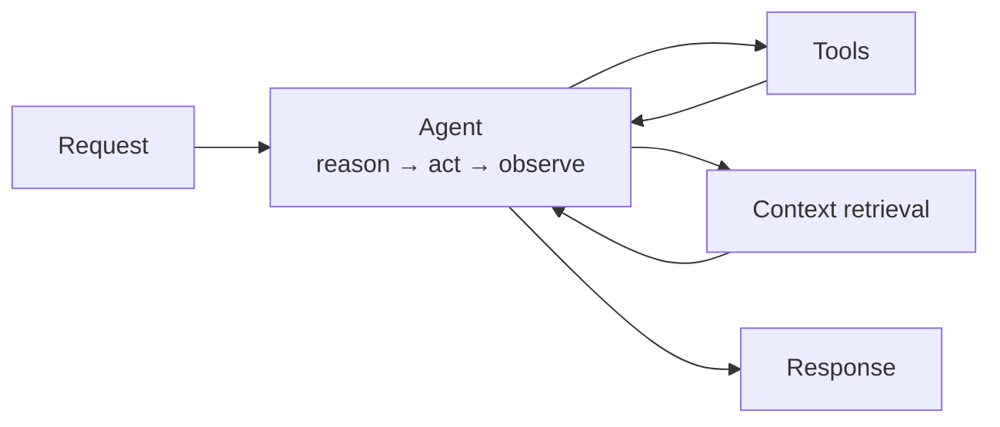
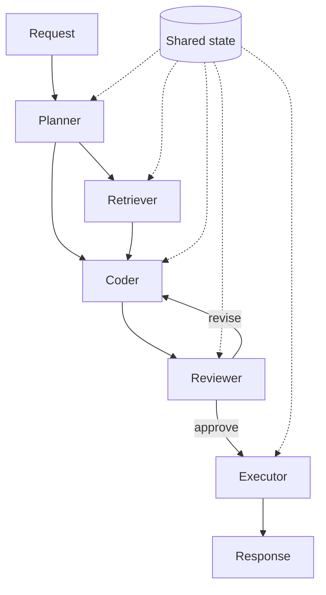

# Architecture patterns

Single-agent versus multi-agent is the first structural decision, and the one most often
made for the wrong reason. This document is mostly an argument for making it deliberately.

---

## The short version

**Start single-agent. Move to multi-agent when you have a specific problem that demands
it, and can name the problem.**

Multi-agent architectures are more interesting to design and more impressive to describe.
They are also harder to debug, slower, more expensive, and have more ways to fail. Those
costs are worth paying for genuinely multi-domain, long-running work. They are pure
overhead on a workflow a single agent handles fine.

The failure pattern is recognizable: a team decomposes into Planner, Researcher, Coder, and
Reviewer agents at the design stage, then spends most of their engineering budget on
coordination bugs rather than on the actual task.

---

## Single-agent systems

A centralized control loop owned by one primary agent, which does the reasoning, calls the
tools, and retrieves the context.

**Best for:** focused workflows with reasonably defined steps. Customer support handling
billing lookups. Document Q&A. Data extraction. A code assistant scoped to one repository.
Anything where you could sketch the happy path on a whiteboard.

**What you get:**

- One place to look when something goes wrong
- Lower latency — no inter-agent round trips
- Simple state management, because there is one owner of state
- Straightforward cost model

**Where it runs out:** genuinely multi-domain tasks where one context window has to hold
too many unrelated concerns, and reasoning quality degrades because the model is tracking
five things that have nothing to do with each other.

That degradation is the real signal to decompose — not the task *sounding* complex.

---

## Multi-agent systems

Work decomposed across specialized agents — Planner, Retriever, Coder, Reviewer, Executor —
coordinating toward a shared goal.

**Best for:** complex, multi-domain, long-running tasks with parallel workstreams and
genuine review loops. Research synthesis across many sources. Large refactors with an
independent verification pass. Workflows where a specialized reviewer catching the
generator's mistakes is the *point*, not decoration.

**What it costs:**

| Cost | What it looks like in practice |
|---|---|
| Coordination overhead | More code in message passing and handoff than in the actual work |
| State complexity | Who owns truth? What happens when two agents write the same field? |
| Latency | Sequential handoffs compound. A five-agent chain has five round trips minimum |
| Cost | Every handoff re-sends context. Token spend grows faster than agent count |
| Failure modes | Each agent can fail, plus every handoff between them, plus deadlock and loops |
| Debuggability | "Which agent decided this, and on what basis?" gets expensive to answer |

**The honest trade:** you are buying specialization and parallelism with coordination cost.
Make sure you need what you are buying.

---

## Choosing

Work down the list. The first "yes" that is genuinely true decides it.

1. **Does one agent already handle this acceptably?** → Single. Ship it.
2. **Do you have evidence of reasoning degradation** — not a hunch, but observed failures
   traceable to too many concerns in one context? → Consider decomposing.
3. **Are there genuinely parallel workstreams** that do not depend on each other's output?
   → Multi-agent buys real latency improvement.
4. **Does the work need independent review** to be correct, where the reviewer must not
   share the generator's context and assumptions? → Multi-agent buys real quality.
5. **Is the task long-running with distinct phases** that have different tool needs and
   different failure modes? → Decomposition helps.
6. **Still unsure?** → Single agent. You can decompose later; un-decomposing is harder.

### The intermediate option people skip

**One agent, multiple tools, one orchestration layer.** Most of the benefit people want
from multi-agent comes from decomposing *the workflow* — not from giving each step its own
agent identity.

A deterministic pipeline where step three calls a different model with a different prompt
and a different tool set is simpler than three agents negotiating, and it delivers the same
specialization. Reach for real multi-agent only when the agents need to make autonomous
decisions about each other's work.

---

## Common structures

Worth knowing by name, because they get conflated.

| Pattern | Shape | Use when |
|---|---|---|
| **Pipeline** | Fixed sequence, each step feeds the next | The sequence is known. Most systems, most of the time |
| **Router** | Classify, then dispatch to a specialized handler | Distinct request types with distinct handling |
| **Orchestrator–worker** | Central planner delegates, collects results | Parallelizable subtasks under one owner |
| **Generator–critic** | One produces, another independently evaluates | Quality matters more than latency; review must be independent |
| **Autonomous loop** | Agent decides its own next step until done | Genuinely unpredictable branching. Always bound it |

**Bounding an autonomous loop is not optional.** Every loop needs a maximum step count, a
wall-clock timeout, a token budget, and a no-progress detector. Without those you have
built something that can spend unbounded money without finishing.

---

## Anti-patterns

**Agents as org chart.** Naming agents after job titles — "QA Engineer," "Product
Manager" — feels natural and produces vague scopes. Agents should be defined by the
concrete work and tools they own, not by a human role they resemble.

**Decomposing before measuring.** Splitting into five agents at the design stage, before
any evidence that one is insufficient. You inherit every coordination cost and none of it
was demonstrably necessary.

**Autonomous where deterministic would do.** Letting the model decide the sequence when the
sequence is known. You pay reasoning tokens on every request to rediscover a workflow you
could have written down, and you get non-reproducible behavior for free.

**Shared mutable state with no owner.** Multiple agents writing the same state with no
defined authority produces bugs that are difficult to reproduce and worse to explain. Every
piece of state needs exactly one writer.

**Unbounded loops.** No step cap, no timeout, no budget. The failure is not that it breaks —
it is that it does not, and you find out from a bill.

---

## Related

- [BUILDING-BLOCKS.md](BUILDING-BLOCKS.md) — the layers each pattern is built from
- [PRODUCTION-PRINCIPLES.md](PRODUCTION-PRINCIPLES.md) — making the chosen pattern reliable
- [checklists/design-review.md](checklists/design-review.md) — review before building
- [ray-orchestrator example](../../examples/ray-orchestrator/README.md) — orchestration in code
