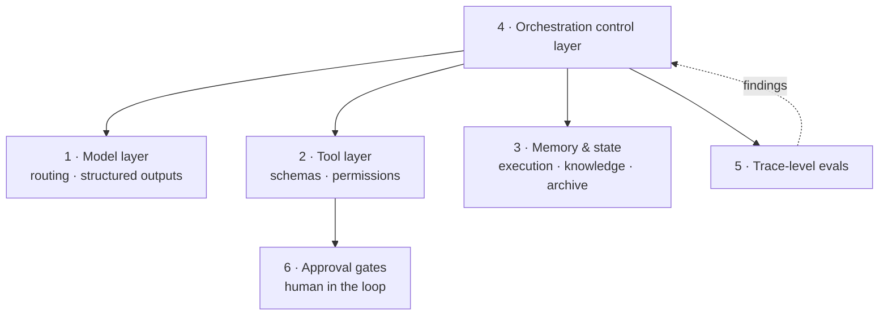
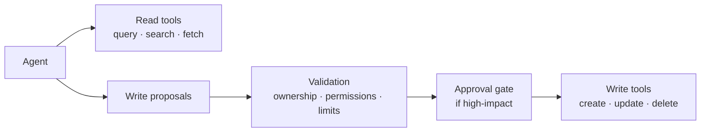
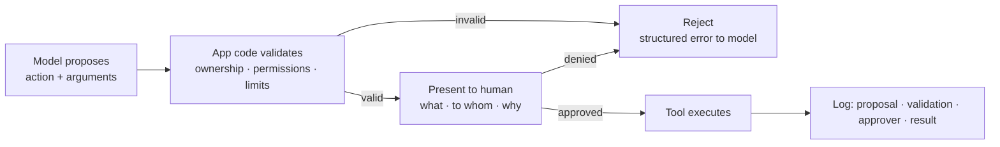

# Building blocks

The six layers every agentic system has, whether or not they were designed. Naming them
makes the implicit decisions explicit.

---

## 1 · Model layer and routing

### Route by complexity

The most common avoidable cost in a production agentic system is a frontier reasoning model
handling every step, including the ones that classify an intent or extract a date.

Send low-complexity steps to smaller, faster, cheaper models:

| Step type | Model tier | Why |
|---|---|---|
| Intent classification | Small | Bounded output space, easy to evaluate |
| Entity extraction | Small | Structured output, verifiable against schema |
| Routing decisions | Small | Few options, deterministic-ish |
| Simple summarization | Small / mid | Quality difference rarely justifies the cost |
| Complex synthesis | Frontier | Genuine multi-step reasoning |
| Ambiguous judgment | Frontier | Where the reasoning gap actually shows |
| Final user-facing output | Mid / frontier | Quality is visible here |

The savings are usually large because the cheap steps are the frequent ones.

**Route on measured need, not intuition.** Start with a capable model everywhere, measure
per-step quality, then downgrade the steps that tolerate it. Downgrading with evals in
place is safe; guessing is not.

### Structured outputs everywhere

**Every intermediate step returns a structured contract, never free-form text.** JSON
Schema, Pydantic models, or tool-call interfaces.

This is not a style preference — it is what makes the system debuggable. A step that
returns prose has no failure mode short of reading it. A step that returns a typed object
either validates or does not, and the failure is caught at that boundary rather than three
steps downstream where it manifests as something inexplicable.

Free-form text is appropriate in exactly one place: the final output to a human.

### Three questions per step

For every step in the system, answer these explicitly:

1. **Which model handles this step?** And what evidence supports that choice?
2. **What exact output contract does it fulfill?** Named schema, versioned.
3. **What is the deterministic fallback on failure?** Retry with the same model? Escalate
   to a larger one? Fail the request? Return a default?

That third question is the one most often skipped, and it is the one that determines
behavior on a bad day. An LLM call without a defined failure path is an outage waiting for
a schedule.

---

## 2 · Tool layer and API contracts

Tools are the interface between the model and everything real — databases, CRMs, payment
gateways, messaging, code execution.

### Treat tools as public APIs

Every tool needs, without exception:

- **Name and description** — the description is what the model uses to choose. Vague
  descriptions produce wrong tool selection, and that failure looks like a reasoning
  failure while actually being a documentation failure
- **Input schema** — typed, validated before execution
- **Output schema** — typed, so downstream steps can rely on shape
- **Timeout** — every external call, no exceptions
- **Permissions** — what this tool may touch, enforced outside the model
- **Structured error responses** — errors the model can reason about and act on, not stack
  traces

### Separate read from write

Hard architectural split, not a convention:

Read tools can be liberally available. Write tools go through validation and, for
high-impact actions, human approval. The model **proposes** writes; application code
**decides** whether they happen.

That inversion is the single most important safety property in the system. It means a
compromised or confused model cannot directly cause an irreversible action.

### Use standard protocols

Model Context Protocol (MCP) and similar standards give you tool exposure and discovery
without inventing your own. The benefit is not the wire format — it is that tools become
portable across systems and testable independently of the agent.

**Vet third-party tool servers like CI plugins.** They run with your agent's permissions.
Who wrote it, what does it access, does it need that access.

### Design notes that save incidents

- **Idempotency keys on every write.** Agents retry. Retries must not double-charge.
- **Bound the result set.** A tool returning ten thousand rows blows the context window and
  costs real money. Paginate, or cap and say so.
- **Errors should teach.** `{"error": "invalid_date_format", "expected": "YYYY-MM-DD", "received": "next tuesday"}`
  lets the model self-correct. `500 Internal Server Error` does not.
- **Fewer tools beats more.** Tool selection accuracy degrades as the count grows. If you
  have forty, consider whether some should be one tool with a mode parameter.

---

## 3 · Memory and state management

**The key principle: separate workflow state from historical memory.** They have different
access patterns, different lifetimes, and different consistency needs. One store for all
three is a design smell.

| Component | Scope | Access pattern | Storage |
|---|---|---|---|
| **Execution state** | Current workflow: step index, collected parameters, tool outputs, approval flags | Read and write on every step, low latency, short-lived | Redis, DynamoDB, PostgreSQL, MongoDB |
| **Knowledge memory** | Retrieved documents, semantic corpus | Read-heavy, similarity search | Pinecone, pgvector, Weaviate, Elasticsearch, OpenSearch |
| **Long-term archive** | Session logs, raw interaction history | Write-once, read rarely, retained long | S3, GCS, object storage |

### Execution state

The working memory of an in-flight request. Needs to survive process restarts, because a
long-running workflow that loses state on a deploy is not production-ready.

Make it **explicit and serializable**. State that lives only in a Python object graph
cannot be resumed, inspected, or debugged after the fact. State in a store can be all
three.

Include: current step, accumulated parameters, tool call results, approval status, retry
counts, and a correlation ID tying it to traces.

### Knowledge memory

Vector search plus the retrieval machinery. Covered in depth under
[Context and RAG design](PRODUCTION-PRINCIPLES.md#context-and-rag-design).

The architectural point here: this is a **read path with its own latency and cost profile**,
and it should be cacheable independently of the model layer. Retrieval results for a common
query should not require a fresh vector search on every request.

### Long-term archive

Everything that happened, kept cheaply. Object storage, not a database.

Worth keeping: full traces, prompt versions, model versions, tool calls with arguments and
results, token counts, costs, latency, and the final outcome. This is what you need for
evaluation, incident investigation, and audit — and it is the thing teams most regret not
having from day one.

**Mask PII before it lands here**, not after. See
[Security and privacy](PRODUCTION-PRINCIPLES.md#observability-security-and-privacy).

---

## 4 · Orchestration control layer

Directs flow from incoming request to final output. This is ordinary application code, and
treating it as ordinary application code is the point.

**Implementation options,** roughly by increasing structure: plain application code, a
state machine, a graph framework such as LangGraph, a temporal workflow engine, or
LlamaIndex workflows.

Plain code is underrated. If your flow is five known steps, five function calls with error
handling beats a framework — you can read it, test it, and step through it in a debugger.

### Pipeline versus autonomous loop

**Use a deterministic pipeline whenever the sequence is mostly known.** Reserve autonomous
reasoning loops for genuine dynamic decision-making.

| | Deterministic pipeline | Autonomous loop |
|---|---|---|
| Sequence | Fixed in code | Model decides each step |
| Reproducible | Yes | Not reliably |
| Debuggable | Step through it | Read a trace and infer |
| Cost | Predictable | Variable, needs a cap |
| Latency | Predictable | Variable |
| Handles the unexpected | Poorly | That is the point |

Most production systems are mostly pipeline with small autonomous regions where branching
is genuinely unpredictable. That mixture is a mature design, not a compromise.

### What graph orchestration buys

Branching, retry loops, and human-in-the-loop gates become first-class rather than
improvised. Worth reaching for when you have all three, and overhead when you have none.

The deeper argument is that a graph makes the control flow **a value rather than a trace**. In
a loop, the topology exists only as it happens — you learn what the agent did by reading logs
afterwards. In a graph, the nodes and edges are declared before anything runs, which changes
four things:

| | Loop | Graph |
|---|---|---|
| Topology | Emerges at runtime | Declared, inspectable, diffable in review |
| Resumption | Wherever you remembered to checkpoint | Node boundaries are natural checkpoints |
| Human gates | An `if` somewhere in the loop body | An interrupt the framework understands |
| Retry | Around the whole step, or hand-rolled | Per node, with its own policy |

The resumption row is the one that usually decides it. A long-running agent *will* be
interrupted — deploys, timeouts, rate limits, approval waits measured in hours — and "resume
from the last completed node" is a sentence you can only say if node boundaries exist. Bolting
checkpoints onto a loop means inventing those boundaries anyway, less carefully.

The human-gate row matters for the same reason [§6](#6--approval-gates-and-policy-controls)
exists: an approval that suspends a workflow for a day is not an `input()` call. It is a durable
interrupt, and frameworks that treat it as one give you the persistence for free.

**Where the cost lands.** A graph is a second representation of your control flow that has to be
kept true — when the code and the graph disagree, the graph is what someone reviewed. Debugging
moves from a stack trace to a framework's execution model. And the declaration is only worth
writing when the topology is stable: a graph rebuilt every request is a pipeline with ceremony.

**A useful heuristic.** Reach for a graph when you can draw the thing on a whiteboard and the
drawing does not change per request. If the drawing changes per request, that is a loop and
should be bounded rather than diagrammed. If the drawing has five boxes in a line, that is five
function calls.

[LangGraph](https://github.com/langchain-ai/langgraph) is the common implementation of this
model — nodes, edges, a shared state object, durable execution, and interrupts as a first-class
concept. [graph-agent](../../examples/graph-agent/README.md) is a minimal one: the same request
routed by an explicit graph, with the approval gate as an interrupt.

### Non-negotiables

Whatever you choose:

- **Every loop is bounded** — max steps, wall-clock timeout, token budget, no-progress
  detection
- **Every step is resumable** — state persisted, so a crash does not lose the workflow
- **Every step is traceable** — one correlation ID from request to response
- **Failure paths are designed, not discovered** — for each step, what happens when it fails

---

## 5 · Trace-level evaluations

**Evaluate every step in the trajectory, not just the final text.** A system judged only on
final output quality is one where you cannot tell *why* it got worse.

### What to evaluate

| Step | Question | How |
|---|---|---|
| Intent classification | Correct intent? | Labeled set, exact match |
| Retrieval | Right documents, ranked well? | Recall@k, precision, human labels |
| Tool selection | Right tool for the request? | Labeled set, exact match |
| Argument formatting | Valid, correct arguments? | Schema validation, deterministic |
| Policy compliance | Any rule violated? | Deterministic rules where possible |
| Task completion | Did it accomplish the goal? | LLM judge plus human spot check |

Notice how many are **deterministic**. Schema validation and exact-match comparison are
cheap, fast, and unambiguous — run them everywhere they apply before reaching for a judge.

### The evaluation stack

**Test suites** covering happy paths, edge cases, partial inputs, and malicious inputs.
That last category is not optional — see [prompt injection](../agentic-coding-playbook/AGENT-SECURITY.md).

**LLM-as-a-judge** for what deterministic checks cannot express: is this answer actually
responsive, is the tone right, did it solve the user's problem. Validate your judge against
human labels before trusting it — an uncalibrated judge is confident noise.

**Human spot checks**, continuously and in production. Sample real traces weekly. This is
how you find the failure modes your test set does not contain, and every mature team ends
up doing it.

### Practical notes

- **Build the eval set from real traffic.** Synthetic cases miss how people actually phrase
  things.
- **Version everything.** Prompt version, model version, retrieval index version. An
  eval result without versions is not reproducible and therefore not useful.
- **Regression-test on every change.** A prompt tweak that improves one intent frequently
  degrades another, silently.
- **Track cost and latency alongside quality.** A change that improves accuracy by two
  percent and triples cost is a decision, not an improvement.

---

## 6 · Approval gates and policy controls

High-impact write operations — refunds, cancellations, code execution, database edits,
external messages — require human-in-the-loop authorization.

### The enforcement flow

**The model proposes. Application code decides. A human authorizes. The tool executes.**

Each of those is a distinct step owned by a distinct component. Collapsing any two of them
is how systems take actions nobody intended.

### What needs a gate

Reach for a gate when the action is irreversible, moves money, touches customer data,
sends external communication, executes code, or changes production configuration.

Do not gate reads, or writes to a scratch namespace that nobody depends on. Gate fatigue is
real — a system that asks for approval on everything trains people to approve without
reading, which is worse than no gate at all.

### Validation belongs in code, not the prompt

"Only refund orders belonging to the requesting user" is a rule the model will follow
almost always. Almost always is not an authorization model.

Check ownership, permissions, and limits in application code, deterministically, every
time. The prompt is a hint; the code is the control.

### Make approvals meaningful

The human needs to see **what** will happen, **to whom**, **why the agent proposed it**, and
**what the effect is**. An approval prompt reading "Execute tool `process_refund`?" is a
rubber stamp with extra steps.

Log the full record: proposal, validation result, who approved, when, and the outcome.
That log is your audit trail and your incident evidence.

---

## Related

- [ARCHITECTURE-PATTERNS.md](ARCHITECTURE-PATTERNS.md) — how these blocks compose
- [PRODUCTION-PRINCIPLES.md](PRODUCTION-PRINCIPLES.md) — making them reliable and affordable
- [checklists/design-review.md](checklists/design-review.md) — review before building
- [rag-faiss](../../examples/rag-faiss/README.md) · [rag-langchain](../../examples/rag-langchain/README.md) — retrieval in code
- [e2e-agent](../../examples/e2e-agent/README.md) — a full example with governance artifacts
