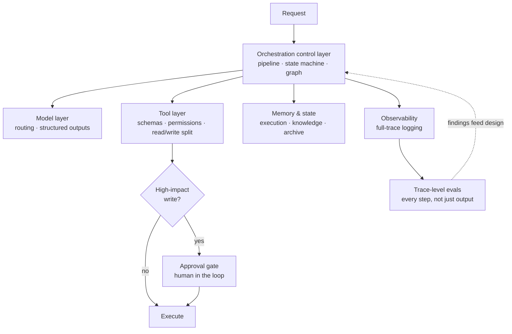

# Agentic System Architecture

Reference architecture for **building** agentic AI systems as production software.

An agentic AI system is not an LLM wrapped in a chat UI. It is a distributed system that
happens to have a probabilistic component in the middle. It reasons over high-level goals
across multiple steps, calls external tools that take real-world actions, retrieves dynamic
context, maintains explicit workflow state, and makes autonomous decisions inside security
and policy guardrails.

Every one of those characteristics is a systems problem before it is a prompting problem.
That framing is the thesis of this folder.

> **Different subject from the playbook.** [agentic-coding-playbook/](../agentic-coding-playbook/README.md)
> is about *using* a coding agent to build software. This folder is about *building*
> agentic systems for production. Related disciplines, different readers.

---

## What is in here

| Path | What it gives you |
|---|---|
| [ARCHITECTURE-PATTERNS.md](ARCHITECTURE-PATTERNS.md) | Single-agent vs. multi-agent — the decision, the trade-offs, and when the second one is a mistake |
| [BUILDING-BLOCKS.md](BUILDING-BLOCKS.md) | The six layers: model routing, tools, memory and state, orchestration, evals, approval gates |
| [PRODUCTION-PRINCIPLES.md](PRODUCTION-PRINCIPLES.md) | Reliability, cost and latency, context and RAG design, observability, security and privacy |
| [checklists/design-review.md](checklists/design-review.md) | A design review to run before building, and again before shipping |
| [REFERENCES.md](REFERENCES.md) | Sourcing and provenance — which claims are measured, which are directional |
| [infra/terraform-aws/](../../infra/terraform-aws/README.md) | This architecture as Terraform on AWS — one module per building block |

---

## The shape of the system

The feedback edge matters as much as the boxes. A system without trace-level evaluation is
one you cannot improve deliberately — you can only change it and hope.

---

## The five decisions that determine everything else

Most architecture debates reduce to these. Answer them explicitly and write the answers
down, because they are expensive to revisit later.

| # | Decision | Default when unsure |
|---|---|---|
| 1 | Single-agent or multi-agent? | **Single.** Multi-agent is a response to demonstrated need, not a starting point |
| 2 | Which model for which step? | Route by complexity. A frontier model on every step is the most common source of avoidable cost |
| 3 | Deterministic pipeline or autonomous loop? | **Pipeline** wherever the sequence is known. Reserve loops for genuine dynamic branching |
| 4 | Where does each kind of state live? | Separate execution state from knowledge memory from archive. Different access patterns, different stores |
| 5 | Which actions need a human? | Any irreversible or high-impact write. Decide before building, not after an incident |

---

## Quick start

**Designing a new system:** [ARCHITECTURE-PATTERNS.md](ARCHITECTURE-PATTERNS.md) →
[BUILDING-BLOCKS.md](BUILDING-BLOCKS.md) → run
[checklists/design-review.md](checklists/design-review.md) before you write code.

**Already have something running:** [PRODUCTION-PRINCIPLES.md](PRODUCTION-PRINCIPLES.md)
and the design review. Most production problems trace back to a missing structured output
contract, an unbounded autonomous loop, or no trace-level evaluation.

**Want to see the patterns in code:** the [examples/](../../examples/) directory has
runnable implementations — [starter-agent](../../examples/starter-agent/README.md),
[rag-faiss](../../examples/rag-faiss/README.md),
[rag-langchain](../../examples/rag-langchain/README.md),
[ray-orchestrator](../../examples/ray-orchestrator/README.md), and
[e2e-agent](../../examples/e2e-agent/README.md) with its architecture diagram, model card,
datasheet, and SLA.

---

## The one-paragraph version

Treat the agentic system as a production software system with a probabilistic component,
not as a prompt with infrastructure attached. Route each step to the cheapest model that
can do it, and make every intermediate step return a structured contract rather than free
text. Give tools real API discipline — schemas, timeouts, permissions, and a hard split
between read and write. Separate execution state from knowledge memory from long-term
archive, because they have different access patterns. Prefer deterministic pipelines and
reserve autonomous loops for genuine branching. Evaluate the whole trajectory rather than
the final string. Put a human in front of anything irreversible. And log full traces from
day one, because a system you cannot see is one you cannot debug.

---

## Related

- [Agentic Coding Playbook](../agentic-coding-playbook/README.md) — using a coding agent well
- [Governance checklist](../governance-checklist.md) · [Security checklist](../security-checklist.md) · [Privacy checklist](../privacy-checklist.md)
- [Model card template](../model-card-template.md) · [Datasheet template](../datasheet-template.md)
- [Incident runbook](../incident-runbook.md)
