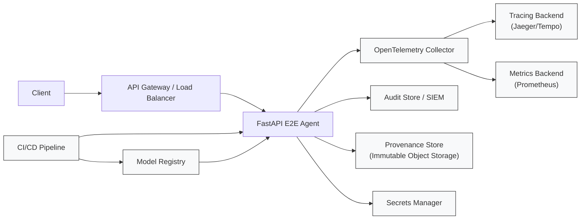

# e2e-agent — architecture

The request path and the four artifacts it leaves behind, in one picture.
[README.md](README.md) explains the reasoning; this page is the diagram and just enough
text to read it.

## Reading it

**One request, four records.** A call to `/invoke` produces a span, an audit line, a
provenance file, and a response — and the first three are written before the response is
returned. The point of the example is that the governance artifacts are not a reporting job
that runs later against data that may already be gone; they are part of the request.

**The trace id ties them together.** `trace_id` is taken from the active span and written
into both the audit entry and the provenance file, so a span in Jaeger, a line in the audit
store, and a file in object storage can be joined after the fact. Without that shared id
the three stores are three separate stories about the same request.

**What the boxes on the right are not.** `Audit Store / SIEM` and `Provenance Store` are
where these artifacts belong in a real deployment — append-only, access-controlled,
separately retained. In this example both are local files next to `app.py`, which is what
makes the flow inspectable and is also the single biggest gap between the example and
something you would run.

**Secrets and the model registry are inputs, not outputs.** The API key arrives from the
environment and the model version from `E2E_AGENT_MODEL`; both are recorded in the
provenance artifact so a stored answer can be traced back to the configuration that
produced it. `E2E_AGENT_API_KEY` has no default — the app refuses to start without it.

The rendered [architecture.svg](architecture.svg) is a snapshot of this diagram, exported by
hand.
