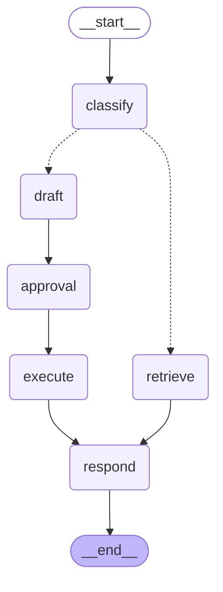

# graph-agent

The same read/write split as [hermes-agent](../hermes-agent/README.md), expressed as an explicit
graph instead of application code. Reading the two side by side is the clearest way to see what
a graph framework buys and what it costs.

```bash
python3 -m venv .venv
.venv/bin/pip install -r requirements.txt
.venv/bin/python graph_agent.py
```

Requires Python 3.10+ — LangGraph dropped 3.9, which makes this the only example here with a
floor above 3.9. No model and no API key: the node functions are deterministic, so the example
stays about the graph.

## The topology, drawn by the graph itself

Not maintained by hand. `graph.get_graph().draw_mermaid()` emits this, which is the concrete
version of "the topology is a value rather than a trace" — the diagram cannot drift from the
code because the code produces it.



## What the graph actually buys

One thing, mostly: **the approval gate is an interrupt rather than a protocol.**

In hermes-agent, pausing for a human means returning a proposal object the caller has to hold
and hand back later. That works, and it puts the burden of durability on the caller. Here the
`approval` node calls `interrupt()`, the graph suspends, its state goes to a checkpointer, and
resuming is `Command(resume=...)` against a thread id — from a different process, hours later.

Swap `InMemorySaver` for the Postgres or SQLite checkpointer and that sentence survives a
deployment. Nothing else in the file changes.

The other three differences are in
[BUILDING-BLOCKS §4](../../docs/agentic-system-architecture/BUILDING-BLOCKS.md): declared
topology, node-boundary resumption, and per-node retry.

## The bug running it found

The first classifier held a keyword list — `("refund", "cancel", "delete", "issue", "charge")`
— and matched substrings. So **"what is the refund policy" routed to the write branch** and
drafted a refund proposal for an order the user had never mentioned.

That is the characteristic failure of a read/write split: it fails *open*, toward the privileged
path. It is left documented in the source rather than quietly corrected, because the lesson
generalises past this example — a bare noun appears in both the question and the command, so a
keyword list is the wrong shape for the job.

The fix here is questions-are-reads-first plus action phrases, which is better but still
guessing from a string. **23 tests now pin it**, including the exact string that was misrouted —
reverting the classifier turns eight of them red. **hermes-agent's design is the more robust one:** it never infers intent
from text at all. The caller names a tool, and the tool is registered read or write. Where you
can dispatch on a declaration instead of a guess, do.

## The second bug, found while fixing the first

`graph_agent.py` called `sys.exit()` at import time when langgraph was missing. A module that
kills the interpreter on import cannot be imported by a test runner — which is why this example
had no tests at all while [harness-agent](../harness-agent/README.md) had 36, and why the
classifier bug above had nothing stopping it from returning.

The routing logic never needed the framework. Only `build()` and `approval()` do, so only they
raise now, and the classifier tests run in the fast CI job with no dependency installed.

## What it costs

- A second representation of control flow that has to stay true. When the code and the graph
  disagree, the graph is what someone reviewed.
- Debugging moves from a stack trace to a framework's execution model.
- A dependency, and this example is the only one of the three added alongside the harness and
  context docs that carries one.

Worth it when the topology is stable and you need durable interrupts. Overhead when your flow is
five steps in a line — that is five function calls.

## Related

- [hermes-agent](../hermes-agent/README.md) — the same boundary in plain application code, with tests
- [Building blocks §4](../../docs/agentic-system-architecture/BUILDING-BLOCKS.md) — orchestration, and when a graph earns its keep
- [Building blocks §6](../../docs/agentic-system-architecture/BUILDING-BLOCKS.md) — approval gates
- [langchain-ai/langgraph](https://github.com/langchain-ai/langgraph) — the framework
