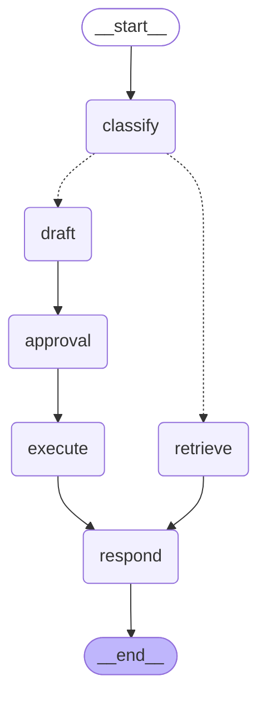
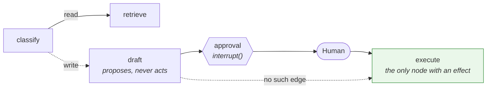

# graph-agent — architecture

The same read/write split as [hermes-agent](../hermes-agent/README.md), expressed as a
declared graph. This document covers the two things the graph form changes: the topology
becomes a reviewable value, and the approval pause becomes durable state rather than an
object the caller has to hold.

## The topology, drawn by the graph itself

Emitted by `graph.get_graph().draw_mermaid()`, not maintained by hand. That is the concrete
meaning of "the topology is a value rather than a trace" — this diagram cannot drift from the
code, because the code produces it.



The single dotted pair out of `classify` is the only branch in the system. Everything else is
a fixed edge, which is what makes `test_the_read_branch_never_reaches_execute` a statement
about the graph rather than about a particular run.

**`approval` sits on the only path to `execute`.** There is no edge from `draft` to `execute`,
and none from `classify`. In `hermes-agent` the equivalent guarantee is a property of the
control flow you have to read the code to establish; here it is an edge set you can assert on,
and `TestTopology` does.

## Where the write boundary actually is



`draft` produces a proposal object and nothing else. `execute` is the only node that acts.
Between them the graph suspends. This is the same rule the Terraform trees enforce with role
grants and the same one `hermes-agent` enforces in application code — the part of the system
that reasons never gets a handle on the part that acts.

## Durability is the thing the graph buys

A plain loop can implement a read/write split perfectly well. What it has to improvise is the
pause.

In `hermes-agent`, an approval is a proposal object the caller holds and hands back, which puts
the burden of durability on the caller. Here `approval` calls `interrupt()`: the graph stops,
its state goes to a checkpointer, and resuming is `Command(resume=...)` against a thread id.

That claim only holds if the state genuinely lives in the checkpointer:

```python
from langgraph.checkpoint.sqlite import SqliteSaver   # pip install langgraph-checkpoint-sqlite

with SqliteSaver.from_conn_string("approvals.db") as saver:
    graph = build(checkpointer=saver)
```

`build()` takes the checkpointer as an argument for a specific reason. It used to hardcode
`InMemorySaver()`, with the README instructing you to edit that line for a real deployment —
so the one thing standing between the demo and a durable approval gate was a source edit that
no test could reach. As an argument it is a seam, and `TestDurableInterrupt` asserts the
property that matters: **a second graph, built separately over the same checkpointer, resumes
a thread the first one suspended.** That is the closest honest proxy for a process restart
that needs no database, and it fails if `build()` ignores what it was passed.

The default stays in-memory deliberately. A durable checkpointer that defaulted on would put
approval state on disk without anyone asking, and the demo and test suite should need no
database to run.

| | In-memory (default) | Durable saver |
| --- | --- | --- |
| Approval takes seconds | works | works |
| Approval takes a day | **state lost with the process** | works |
| Resume from another process | **impossible** | works |
| Needs a database | no | yes |

## The classifier is the known weak point, and is kept on purpose

`classify` decides read or write by matching phrases. That is the wrong shape for the job and
the code says so at length: a noun appearing in both a question and a command cannot separate
them. The first version of the phrase list held `"refund"`, and *"what is the refund policy"*
— a question — routed to the write branch and drafted a refund for an order nobody mentioned.

Two things follow, and the second is the reason it is still here.

**It now fails closed.** Questions are checked first and anything unmatched falls to `read`. An
unrecognised request reaching the read branch returns "No matching knowledge"; one reaching the
write branch drafts a proposal. The safe default is the one that cannot propose.

**Fixing it properly would delete the subject.** `hermes-agent` avoids the problem entirely by
never inferring intent from text — the caller names a tool and the tool is registered read or
write. That is the better design, and it is also a design with no conditional edge in it. This
example exists to show a graph, and a graph with no branch demonstrates nothing. So the
classifier stays, documented as the weak point, with the better answer named.

Where you can dispatch on a declared tool instead of guessing from a string, do.

## Deliberately not here

- **No model.** The node functions are deterministic, which keeps the example about the graph
  rather than about a prompt, and keeps the suite runnable without a key.
- **No Postgres checkpointer.** `langgraph-checkpoint-sqlite` and the Postgres saver are
  separate packages. Pinning one here would add a dependency to make a point the injected
  argument already makes.
- **No retries or error edges.** Real graphs have both. They would double the topology without
  changing anything about the write boundary, which is what this example is for.
