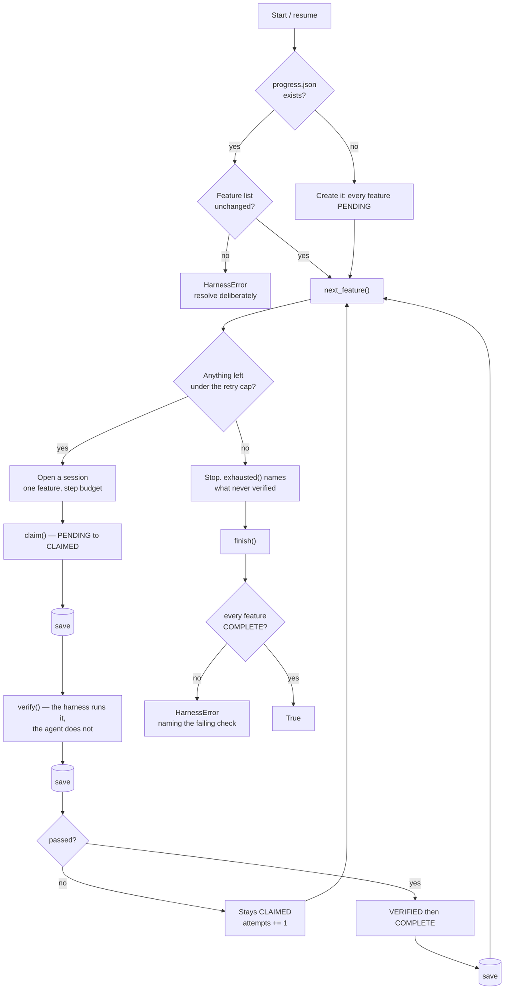
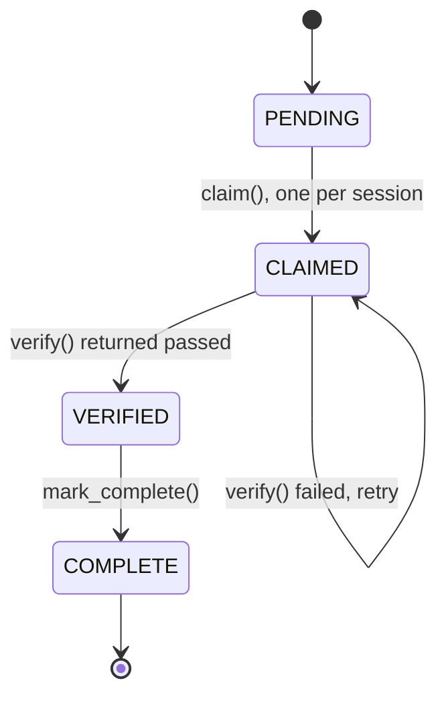

# harness-agent — architecture

The harness is everything around the model that decides what it sees, what it may do, and
whether it is finished. This example implements the third of those, because it is the one
whose failures are silent: a model that cannot call a tool gets an error, while a model that
declares premature victory gets agreement.

## The loop across context windows

Three saves per session, not one at the end. The failure this design exists for is the session
that never reaches its end — killed, out of context, crashed — and a save at the end protects
only the sessions that were going to be fine anyway.

## The state machine

`advance` checks the *step*, not just the destination. That distinction is the whole guard:
`advance(f, COMPLETE)` from `CLAIMED` is exactly what "marked done without testing" looks like
in code, and refusing it by destination alone would still permit `PENDING → VERIFIED`.

## The four failure modes, and where each is closed

Named in Anthropic's [Effective harnesses for long-running agents](https://www.anthropic.com/engineering/effective-harnesses-for-long-running-agents).

| Failure mode | Closed by | Test class |
| --- | --- | --- |
| Premature completion | `finish()` reads the progress file, not the agent | `TestPrematureCompletion` |
| Over-ambition | `claim()` raises on the second call in a session | `TestOverAmbition` |
| Incomplete testing | `COMPLETE` is unreachable from `CLAIMED` | `TestIncompleteTesting` |
| State degradation | atomic `os.replace`; corrupt files raise, not restart | `TestStateDegradation` |

A fifth guard came from running the demo rather than from the source: the harness retried a
permanently-failing check until its session budget was gone, then reported the budget instead
of the check. That is the no-progress bound the architecture docs list alongside steps,
wall-clock, and tokens — see [BUILDING-BLOCKS §4](../../docs/agentic-system-architecture/BUILDING-BLOCKS.md).
`TestNoProgressBound` covers it.

## Why there is no model here

A harness's guarantees are properties of the harness. It either refuses a transition or it does
not, and that is decidable without asking anything of a model — so the agent in these tests is
a scripted verifier, and all 36 assertions are deterministic and offline.

The same move as [hermes-agent](../hermes-agent/README.md), whose router is tested without a
model, and [trace-eval](../trace-eval/README.md), whose graders are. It is also what makes the
suite safe to gate merges on: a check that needs a key is a check that breaks when the key
rotates.

## What this example does not do

It does not manage the context window itself — no compaction, no note-taking, no retrieval.
That is the other half of harness work and is treated in
[CONTEXT-ENGINEERING.md](../../docs/agentic-system-architecture/CONTEXT-ENGINEERING.md).

It also has no approval gate. A harness deciding it is finished is a different question from a
harness being allowed to act, which is [hermes-agent](../hermes-agent/README.md)'s subject.
