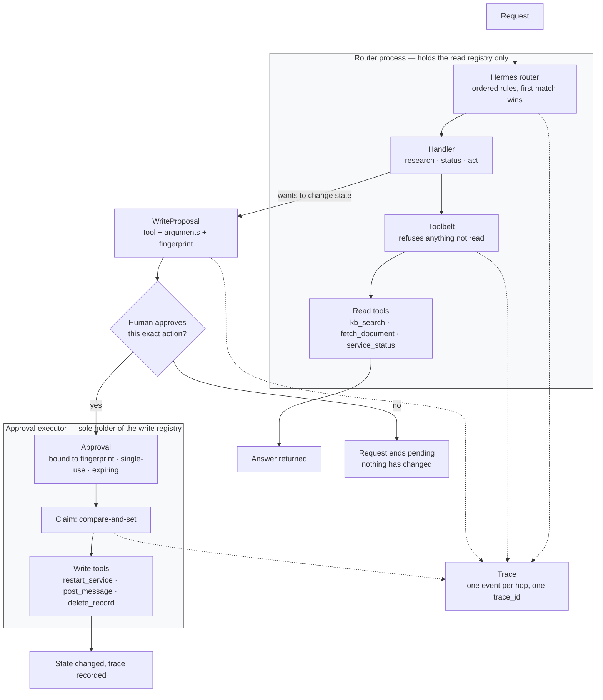

# Hermes — a router that cannot perform the actions it routes

Hermes takes a request, works out which handler owns it, and carries it there. It is named
for the messenger because that is the whole of its job: it is a courier, not an authority.
Read work runs on the spot. Anything that would change state comes back as a proposal and
stops, until a human approves *that specific action*.

This is the application-layer counterpart to [infra/](../../infra/). Those Terraform trees
enforce the same property with cloud IAM — an orchestrator that physically cannot invoke a
write tool. Here the same boundary is drawn in about 370 lines of standard-library Python —
the router, the tool split, the approval claim, and the trace — plus a wired-up demo and a
CLI. Nothing to install, no cloud account, no model.

```bash
python3 examples/hermes-agent/agent.py "summarize incident-2291"
python3 examples/hermes-agent/agent.py "restart the billing service"
python3 examples/hermes-agent/agent.py --approve "restart the billing service"
```

---

## The shape of it



The two boxes are two objects. `Hermes` is constructed with the read registry and refuses
the write one; `ApprovalExecutor` is constructed with the write registry and refuses the
read one. They share an approval store and nothing else.

The same diagram with notes on how to read it: [architecture.md](architecture.md).

---

## The boundary, and why it is drawn twice

A write cannot happen by the router's path, for two independent reasons:

1. **The router has no reference to a write callable.** `build_agent()` returns two
   objects. The write tools live inside the executor. There is no attribute on `Hermes`
   that reaches them, so the boundary is not a check to be bypassed — it is a name that
   does not resolve.
2. **The toolbelt refuses on access anyway.** If a write tool somehow appeared in the read
   registry, `Toolbelt.call` raises `WriteBoundaryViolation` before running it.

Either one is sufficient. Keeping both is the same reasoning the AWS tree uses for its
identity policy and resource policy: the second lock exists for the day someone edits the
first one for a good reason.

An approval, once granted, is constrained three ways:

| Control | What it prevents |
|---|---|
| Bound to a fingerprint of tool + exact arguments | Approving `restart_service(service="billing")` does not approve `restart_service(service="payments")`, and does not approve `delete_record` at all |
| Single-use, claimed by compare-and-set | A token replayed, or two racing claims both winning |
| Expiring | An approval quietly becoming a standing credential |

The claim is the in-process analogue of the primitive each cloud tree uses for the same
job — a DynamoDB condition expression on AWS, a Firestore transaction on GCP, a Cosmos
ETag on Azure. Same invariant, three implementations, because that is the primitive each
provider hands you.

The claim happens **before** the tool runs. Reversing those two lines leaves a crash
between them with the action done and the token still spendable, and
`test_failed_claim_does_not_run_the_tool` fails if anyone reverses them.

---

## Routing is ordered rules, on purpose

`Router.classify` walks keyword rules in order and returns the first match, along with the
keyword that fired. Two decisions worth naming:

**Rules rather than a model.** Routing is the step you most want to explain after the
fact. "The word `restart` matched, so this went to `act`" is an explanation; a model's
judgement is a guess you re-run and hope reproduces. When your intents stop being separable
by vocabulary, replace `Router.classify` — its return type is the seam, and nothing
downstream changes.

**Word boundaries rather than substrings.** `"is" in "summarize this incident"` is true,
because it is inside `th(is)`. A substring router sends that request to a status handler
and logs a confident reason for doing so. This example had that bug during development and
now has `test_keyword_matches_on_word_boundaries_not_substrings` to keep it fixed.

Order encodes policy: the `act` route is first, so a request naming both a lookup and a
change — *"find the stale records and delete incident-2291"* — lands on the path that asks
a human rather than the one that answers on its own.

---

## Running it

Nothing to install; Python 3.9 or newer.

```bash
# Read path — two tool calls, an answer, no approval anywhere
python3 examples/hermes-agent/agent.py "summarize incident-2291"

# Write path — stops at a proposal, exits 2
python3 examples/hermes-agent/agent.py "restart the billing service"

# Write path, approved — the script stands in for a human clicking approve
python3 examples/hermes-agent/agent.py --approve "restart the billing service"
```

```text
trace   1d79af7cd7054745b6df9dfe51119ba9
intent  act → act()
status  awaiting approval
write   restart_service(service='billing')
why     Service 'billing' reports healthy=True; a restart clears the connection pool…
digest  9ef8f9b497df3e68…
next    re-run with --approve to authorise exactly this action
```

Exit codes: `0` completed, `2` awaiting approval. A pending write is not a failure and not
a success, and a caller scripting this should be able to tell without parsing prose.

Flags: `--quiet` drops the trace, `--json` prints the result as JSON, `--approver NAME`
sets the name recorded on the approval.

The trace goes to stderr as one JSON object per line, so the answer on stdout stays pipeable:

```json
{"event": "request.classified", "fallback": false, "intent": "act", "matched": "restart", "seq": 2, "trace_id": "1d79…"}
{"event": "write.proposed", "fingerprint": "9ef8…", "seq": 4, "tool": "restart_service", "trace_id": "1d79…"}
```

---

## Tests

```bash
python3 -m unittest tests.test_hermes_agent -v
```

31 tests in [tests/test_hermes_agent.py](../../tests/test_hermes_agent.py), in two groups.
The behavioural ones check that requests route where they should. The boundary ones check
that a write *cannot* happen by the wrong path, including one that corrupts a registry past
its own guard to confirm the second lock holds when the first is defeated.

Those were mutation-tested rather than trusted: eight deliberate breaks — dropping the
access check, unbinding the fingerprint, never marking a token spent, skipping expiry,
running the tool before claiming, reverting to substring matching, letting `Hermes` accept
the write registry, letting the registry accept any access level — and all eight are caught.
A boundary test that never fails is decoration.

---

## What this example is not

- **Not a model integration.** No LLM is called. The handlers are deterministic so that the
  boundary is what you are looking at. Point `Router.classify` and the handler bodies at a
  model and the structure above is unchanged, which is the claim being made.
- **Not durable.** Approvals live in a dict in one process. A real deployment puts them in
  the state store the rest of the system already trusts. What must survive that swap is the
  compare-and-set in `claim` — if the backing store cannot do it atomically, it is the wrong
  store, not something to paper over with a read-then-write.
- **Not an authorization system.** `--approve` grants its own approval, which is a demo
  standing in for a human. Who may approve what belongs to your identity provider.
- **Not doing argument extraction seriously.** `_subject` and `_service_name` in `demo.py`
  guess identifiers out of prose with a regex. Real systems take structured arguments from a
  model's tool call. Argument extraction is exactly where an approval most easily ends up
  bound to the wrong thing, which is worth saying out loud rather than hiding behind a
  tidier demo.

---

## Files

| Path | What it holds |
|---|---|
| [`hermes/router.py`](hermes/router.py) | `Router`, `Hermes`, `WriteProposal`, `ApprovalExecutor` — read this first |
| [`hermes/tools.py`](hermes/tools.py) | The read/write split, the two registries, `Toolbelt` |
| [`hermes/approvals.py`](hermes/approvals.py) | Fingerprinting, the approval record, the compare-and-set claim |
| [`hermes/trace.py`](hermes/trace.py) | One structured event per hop |
| [`hermes/demo.py`](hermes/demo.py) | Simulated tools, three handlers, the wiring |
| [`agent.py`](agent.py) | CLI |

---

## Related

- [docs/agentic-system-architecture/BUILDING-BLOCKS.md](../../docs/agentic-system-architecture/BUILDING-BLOCKS.md) — tool contracts and approval gates as building blocks
- [infra/](../../infra/) — the same boundary enforced by AWS, Azure, and GCP IAM
- [examples/e2e-agent/](../e2e-agent/README.md) — tracing, audit, and provenance over HTTP
