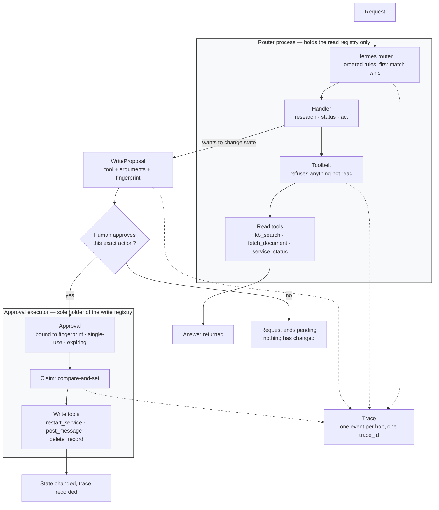

# Hermes — architecture

The router and the write boundary in one picture. [README.md](README.md) explains the
reasoning; this page is the diagram and just enough text to read it.

## Reading it

**The two boxes are two objects, not two phases.** `Hermes` is constructed with the read
registry and refuses the write one; `ApprovalExecutor` is constructed with the write
registry and refuses the read one. They share an approval store and nothing else. No arrow
crosses from the upper box into the lower one, and that absence is the design: the router
holds no reference that reaches a write tool.

**The only path between them runs through a human.** A handler that wants to change state
returns a `WriteProposal` — inert data carrying the tool name, the exact arguments, and a
fingerprint of both. The run ends there. Approving resumes it; not approving leaves a
request that completed normally, having changed nothing.

**The claim is a compare-and-set, and it happens before the tool runs.** Reversing those
two would leave a crash between them with the action done and the token still spendable.

**The dotted edges are the trace.** Every hop emits one event under a shared `trace_id`, so
a run reads back as an ordered account of what happened and why. That stream is what
[examples/trace-eval](../trace-eval/README.md) scores — it is the only place the fact "this
write was authorised" is recorded, since it never reaches the answer the user sees.

## Related

- [README.md](README.md) — the reasoning, the tests, and what this example is not
- [examples/trace-eval/](../trace-eval/README.md) — scoring the path this diagram describes
- [infra/](../../infra/) — the same boundary drawn with cloud IAM instead of Python
