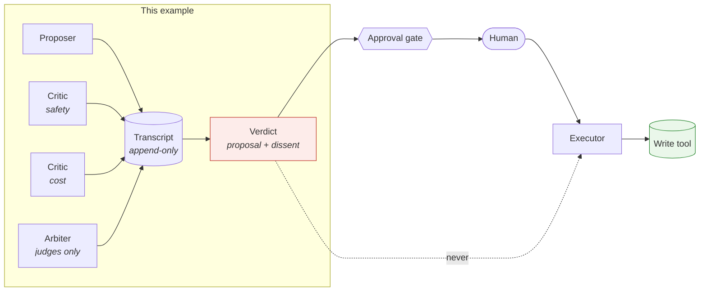
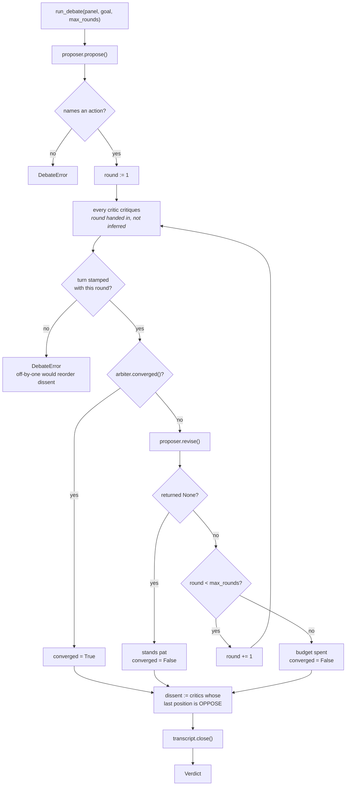

# multi-agent-debate — architecture

Multi-agent coordination is usually presented as a capability question: can several agents
together do something one cannot? This example takes the narrower and more useful view —
given that you are going to run several agents, **what does the coordination layer owe you,
and what must it refuse to do?**

The answer to the second half is short and is the reason the package is shaped the way it is:
it must refuse to authorize.

## Where this sits

> **[Interactive architecture diagram](../../docs/diagrams/multi-agent-debate-architecture.html)** — open in browser for the full interactive view.

Mermaid source (kept for diff history)

The dotted line is the whole design. A `Verdict` is an input to the approval gate, never a
substitute for it. Everything in `verdict.py` exists to make that structural rather than
conventional: there is no approval field, `requires_human_approval` is a property with no
backing state, and a test asserts the dataclass has not grown one under a friendlier name.

This mirrors, one layer up, what `infra/*/modules/approval` does in Terraform — the executor
role is granted the claim capability and deliberately never the approve capability, because a
machine principal that can approve its own proposal turns the gate into a formality.

## The loop

Additional diagram

Three properties of that loop are worth naming, because each is a place the obvious
implementation is wrong.

**Exhaustion is not convergence.** The shortest correct-looking loop argues until
`max_rounds` and returns the last proposal. It passes tests, and a caller cannot tell an
agreement from a timeout. `converged` is set only where agreement actually happened.

**Dissent is computed from last positions, not from any position.** A critic who objected in
round one and was satisfied by a revision in round two is not a dissenter. A critic who
objected and was never answered is. Getting this backwards either buries real objections or
reports resolved ones forever.

**The round number is handed to the critic.** An earlier version had critics infer their round
from the transcript, which broke the first time the protocol changed how many turns precede a
critique. The off-by-one was silent: it reordered `last_position`, which is what dissent is
built from. The protocol now passes the number and validates what comes back.

## Role separation

| Role | May propose | May take a position | May end the debate |
| --- | --- | --- | --- |
| Proposer | yes | via `REVISE` | by standing pat |
| Critic | no | yes | no |
| Arbiter | no | no | yes |

`Panel.check_turn` enforces the two cells that matter — an arbiter emitting anything other
than `SUPPORT`, and a critic emitting `PROPOSE`. Both are rejected at the turn, not at
review, because both are invisible downstream: an arbiter that has started arguing still
produces a well-formed verdict.

`Panel.__post_init__` enforces the composition rules before a debate can start at all: at
least two critics, distinct perspectives, distinct names, and an arbiter that is neither the
proposer nor a critic. Role collisions are checked before the generic duplicate-name check,
so the error says what is actually wrong rather than sending the reader to look for a typo.

## What a panel of clones costs

The failure is not that a clone panel gives a wrong answer. It gives a *confident* one.

Three critics running the same model with the same prompt produce one opinion sampled three
times. The transcript then shows unanimous support across three participants, which reads —
to a human, and to any metric built on the transcript — as three independent confirmations.
The debate has manufactured corroboration out of nothing, and the resulting verdict is more
trusted than the single-model answer it is equivalent to.

`DegeneratePanel` refuses that panel at construction. `perspective` is a declared string
rather than something inferred, which means it can be declared dishonestly — this catches the
accident, not the adversary.

## Deliberately not here

- **No model.** The participants are scripted. A protocol's guarantees are properties of the
  protocol; a model behind the roles adds variance, not coverage, and would make the suite
  need a key. Same reasoning as `harness-agent`'s verifier and `trace-eval`'s graders.
- **No concurrency.** Critics speak in sequence. Parallel critique is a real optimisation and
  it changes nothing about the guarantees, so it would add machinery without adding subject.
- **No voting.** Counting critics is a tempting way to decide, and it converts disagreement
  into a number that hides which objection was outstanding. The dissent list keeps the
  objection itself, which is what the human approving the action actually needs.
- **No persistence.** The transcript lives for the debate. A real deployment would write it
  alongside the proposal — `trace-eval` is the example for scoring what it contains.
