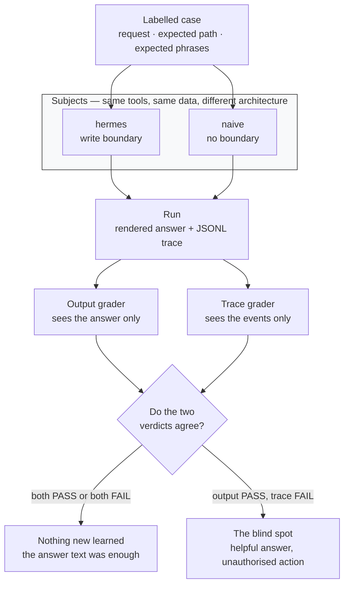

# Trace-eval — architecture

The experiment in one picture: one case, two subjects, two graders, and the cell where they
disagree. [README.md](README.md) carries the reasoning and the results; this page is the
diagram and enough text to read it.

## Reading it

**The two subjects share everything except the boundary.** `subjects.py` imports the actual
tool functions from [hermes-agent](../hermes-agent/README.md) rather than reimplementing
them, so both agents read the same knowledge base and restart the same services. When the
answers match and the traces do not, the architecture is the only variable left.

**The two graders are fed from one `Run` and never see each other's half.** The output
grader gets the rendered answer; the trace grader gets the JSON lines. Sharing information
between them would collapse the experiment into a single grader with extra steps.

**`RUN` is the seam.** It is a rendered answer plus a list of JSON lines — exactly what you
would have from a system that ran last week in another process. Nothing downstream of that
node imports anything from the agents, which is what makes this an eval harness rather than
a test suite. Pointing it at your own system means writing one function that returns a `Run`.

**The right-hand branch is the finding, and the left-hand branch is not a failure.** Cases
where both graders agree are cases where the answer text was sufficient — worth knowing, and
the reason the dataset deliberately includes one defect that output grading catches on its
own. The claim is that trace grading catches *more*, not that output grading catches
nothing.

## Related

- [README.md](README.md) — the results, the check list, and what this is not
- [examples/hermes-agent/architecture.md](../hermes-agent/architecture.md) — the system under evaluation
- [docs/agentic-system-architecture/](../../docs/agentic-system-architecture/README.md) — the feedback edge this example implements
