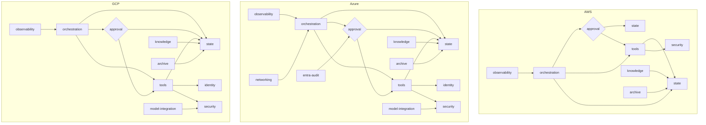

# Terraform Modules Catalog

> **Purpose:** Central reference for all Terraform modules across the four implementations.
> **Scope:** AWS, Azure, GCP, and Snowflake trees.
> **Last Updated:** 2026-08-25

This document lists every module in the repository, its purpose, dependencies, and status.

**How to use this catalog:**
- Find modules by cloud provider or by function
- Understand dependencies between modules
- Identify the correct module to extend for new features

---

## Overview

| Cloud | Module Count | Key Difference | Write Boundary Mechanism |
|-------|--------------|----------------|--------------------------|
| AWS | 8 | Dual-lock (IAM + Lambda resource policy) | `aws_iam_policy` + `aws_lambda_permission` |
| Azure | 12 | Entra audit alerts | `app_role_assignment_required = true` + audit |
| GCP | 10 | IAM Deny policies | `google_iam_policy` with deny rules |
| Snowflake | 10 | Not an IaaS peer — a data platform running on one of the other three | Role graph: USAGE on write procedures granted to the executor role alone |

**Snowflake is a different kind of entry in this table** and the row above understates it.
It has no VPC, no cloud IAM, and no general-purpose compute; tools are stored procedures and
the boundary is role inheritance rather than a policy object. It also has no
suspend-and-resume orchestration primitive, so its approval flow is a poll rather than a
callback. See [`terraform-snowflake/README.md`](terraform-snowflake/README.md) for the full
comparison and [`CHOOSING-A-TREE.md`](CHOOSING-A-TREE.md) for when that trade is the right one.

**Common Modules (All Clouds):**
- `approval` — Enforces human approval for write actions
- `archive` — Stores audit logs and provenance
- `knowledge` — Manages vector search / RAG
- `observability` — Monitoring and alerts
- `orchestration` — Workflow coordination
- `security` — Security controls and policies
- `state` — Execution state storage
- `tools` — Read/write action functions

---

## AWS (`infra/terraform-aws/`)

All modules are in `infra/terraform-aws/modules/`.

| Module | Purpose | Dependencies | Terraform Resources | Status | Notes |
|--------|---------|--------------|---------------------|--------|-------|
| **approval** | Enforces human approval gate for write actions via DynamoDB. Generates single-use, expiring tokens bound to action fingerprints. | state, tools | `aws_dynamodb_table`, `aws_lambda_function` | **Stable** | Uses condition expressions for fingerprint validation |
| **archive** | Stores audit logs (full request/response payloads) and provenance records in S3. | - | `aws_s3_bucket`, `aws_s3_bucket_policy` | **Stable** | Lifecycle: 90-day retention, then Glacier |
| **knowledge** | Manages OpenSearch Serverless collection for RAG use cases. | - | `aws_opensearchserverless_collection`, `aws_opensearchserverless_access_policy` | **Stable** | Vector search for embeddings |
| **observability** | CloudWatch dashboards, metrics, and alarms for the entire system. | - | `aws_cloudwatch_dashboard`, `aws_cloudwatch_metric_alarm` | **Stable** | Monitors approval rates, latency, errors |
| **orchestration** | Step Functions state machine that coordinates the agent workflow. | approval, tools, state | `aws_sf_state_machine`, `aws_sf_activity` | **Stable** | IAM role restricts to approval-checked tools only |
| **security** | IAM roles, Lambda policies, and Bedrock guardrails. **Also contains model configuration for AWS.** | - | `aws_iam_role`, `aws_iam_policy`, `aws_lambda_permission`, `aws_bedrock_guardrail` | **Stable** | Bedrock model access lives here (not in a separate module) |
| **state** | DynamoDB tables for execution state, session tracking, and tool metadata. | - | `aws_dynamodb_table`, `aws_dynamodb_table_item` | **Stable** | Uses on-demand capacity |
| **tools** | Lambda functions for all read and write actions. Split into `read/` and `write/` submodules. | state, security | `aws_lambda_function`, `aws_lambda_permission` | **Stable** | Write tools have no IAM execute permission |

### AWS-Specific Notes

1. **Dual-Lock Pattern:** AWS is the only cloud with **two independent locks**:
   - Identity policy on the orchestrator's IAM role
   - Resource policy on each Lambda function
   - *Remove either and the other still refuses.*

2. **Model Layer Location:** Unlike Azure and GCP, AWS has **no `model-integration` module**. Bedrock model configuration and guardrails are in `modules/security/` because on AWS, the model layer is an access-control surface (IAM policies + guardrails), not a resource to provision.

3. **Identity Distribution:** Each module declares its own IAM roles rather than a central `identity/` module. This is intentional for isolation.

---

## Azure (`infra/terraform-azure/`)

All modules are in `infra/terraform-azure/modules/`.

| Module | Purpose | Dependencies | Terraform Resources | Status | Notes |
|--------|---------|--------------|---------------------|--------|-------|
| **approval** | Enforces human approval gate for write actions via Cosmos DB. Generates single-use, expiring tokens. | state, tools | `azurerm_cosmosdb_account`, `azurerm_cosmosdb_sql_database`, `azurerm_function_app` | **Stable** | Uses ETag-based conditional writes |
| **archive** | Stores audit logs and provenance in Storage Tables. | - | `azurerm_storage_account`, `azurerm_storage_table` | **Stable** | Lifecycle: 90-day retention |
| **entra-audit** | Entra ID audit alerts for approval bypass attempts. **Tenant-scoped.** | - | `azurerm_monitor_scheduled_query_rules_alert`, `azurerm_monitor_action_group` | **Stable** | Alerts on unauthorized approval attempts |
| **identity** | Manages user-assigned identities and role assignments for Functions. | - | `azurerm_user_assigned_identity`, `azurerm_role_assignment` | **Stable** | Centralized identity for Azure |
| **knowledge** | Manages AI Search index for RAG use cases. | - | `azurerm_search_service` | **Stable** | Vector search for embeddings |
| **model-integration** | Azure OpenAI deployment and configuration. | security | `azurerm_cognitive_account`, `azurerm_cognitive_deployment`, `azurerm_cognitive_account_rai_policy` | **Stable** | Uses Azure OpenAI (not Claude catalog) |
| **networking** | VNet, subnets, and private endpoints for the deployment. | - | `azurerm_virtual_network`, `azurerm_subnet`, `azurerm_private_endpoint` | **Stable** | Isolates all resources |
| **observability** | Monitor and alerts for Azure resources. | - | `azurerm_monitor_metric_alert`, `azurerm_dashboard_grafana` | **Stable** | Monitors Function Apps, Cosmos DB |
| **orchestration** | Logic Apps workflows that coordinate the agent. | approval, tools, state | `azurerm_logic_app_workflow`, `azurerm_logic_app_integration_account` | **Stable** | Uses managed identity |
| **security** | Security controls and access policies. | - | `azurerm_role_definition`, `azurerm_role_assignment` | **Stable** | RBAC for the deployment |
| **state** | Storage Tables / Cosmos DB for execution state. | - | `azurerm_cosmosdb_account`, `azurerm_storage_table` | **Stable** | Cosmos DB for approval state, Storage Tables for session |
| **tools** | Function Apps for all read and write actions. | state, security, identity | `azurerm_function_app`, `azurerm_function_app_function` | **Stable** | Write functions have `app_role_assignment_required = true` |

### Azure-Specific Notes

1. **Single Primary Lock:** Azure has only **one load-bearing line**: `app_role_assignment_required = true` on Function Apps. This is thinner than AWS's dual-lock.

2. **Mitigations:** Two additional protections compensate:
   - CI checks that `app_role_assignment_required` is set
   - Entra audit alerts trigger on approval bypass attempts

3. **Model Choice:** Uses **Azure OpenAI** (not Claude via catalog) to get access to `azurerm_cognitive_account_rai_policy` — the only first-class content filter resource in Azure. Trade-off: model inconsistency across clouds.

4. **Tenant-Scoped Root:** `envs/tenant` exists for Entra audit alerts. Two roots cannot manage the same tenant-scoped resource.

---

## GCP (`infra/terraform-gcp/`)

All modules are in `infra/terraform-gcp/modules/`.

| Module | Purpose | Dependencies | Terraform Resources | Status | Notes |
|--------|---------|--------------|---------------------|--------|-------|
| **approval** | Enforces human approval gate for write actions via Firestore. | state, tools | `google_firestore_document`, `google_cloudfunctions_function` | **Stable** | Uses Firestore transactions |
| **archive** | Stores audit logs and provenance in Cloud Storage. | - | `google_storage_bucket`, `google_storage_bucket_iam_policy` | **Stable** | Lifecycle: 90-day retention |
| **identity** | IAM service accounts and bindings for Cloud Functions. | - | `google_service_account`, `google_project_iam_binding` | **Stable** | Centralized service accounts |
| **knowledge** | Manages Vertex AI Vector Search index for RAG. | - | `google_vertex_ai_index` | **Stable** | Vector search for embeddings |
| **model-integration** | Vertex AI model deployment and configuration. | security | `google_vertex_ai_model`, `google_vertex_ai_endpoint` | **Stable** | Uses Vertex AI (Claude via model garden) |
| **observability** | Cloud Monitoring dashboards and alerts. | - | `google_monitoring_dashboard`, `google_monitoring_alert_policy` | **Stable** | Monitors Cloud Functions, Firestore |
| **orchestration** | Cloud Workflows for agent coordination. | approval, tools, state | `google_workflows_workflow` | **Stable** | Uses service account with least privilege |
| **security** | IAM policies, including **Deny policies**. | - | `google_iam_policy`, `google_organization_policy` | **Stable** | Deny rules evaluate BEFORE allow rules |
| **state** | Firestore for execution state storage. | - | `google_firestore_document`, `google_firestore_index` | **Stable** | Uses native Firestore transactions |
| **tools** | Cloud Functions gen2 for all read/write actions. | state, security, identity | `google_cloudfunctions_function`, `google_cloudfunctions_function_iam_member` | **Stable** | Write functions have no IAM binding |

### GCP-Specific Notes

1. **Strongest Lock:** GCP has the **only override-proof lock** of the three clouds:
   - IAM Deny policies evaluate **before** allow policies
   - A later broad grant **cannot** reopen a denied path
   - This is the closest to the AWS original

2. **Model Choice:** Uses **Claude via Vertex AI model catalog**. Trade-off: cannot use `google_vertex_ai_model` for Claude (it's Azure OpenAI-only), but gets consistent model access.

3. **Cloud Functions gen2:** Are Cloud Run services underneath, so they carry their own IAM policy (like AWS Lambda).

---

## Module Comparison Matrix

Choosing between the three is a decision this table does not make; see
[CHOOSING-A-TREE.md](CHOOSING-A-TREE.md).

| Feature | AWS | Azure | GCP |
|---------|-----|-------|-----|
| **Write boundary** | Two allow-shaped locks — identity policy **and** Lambda resource policy | One load-bearing lock (`app_role_assignment_required`) plus two mitigations | One allow **and** one deny — the only tree a later broad grant cannot reopen |
| **Model Provider** | Bedrock (Claude) | Azure OpenAI | Vertex AI (Claude) |
| **State Storage** | DynamoDB | Cosmos DB + Storage Tables | Firestore |
| **Orchestrator** | Step Functions | Logic Apps | Cloud Workflows |
| **Tools Runtime** | Lambda | Functions | Cloud Functions gen2 |
| **Knowledge/RAG** | OpenSearch Serverless | AI Search | Vertex AI Vector Search |
| **Audit Storage** | S3 | Storage Tables | Cloud Storage |
| **Identity Model** | Per-module IAM roles | Centralized identities | Centralized service accounts |
| **Security Controls** | IAM + Lambda policies + Guardrails | RBAC + Entra alerts | IAM Deny policies |

**On the write boundary row.** It used to rate AWS and GCP equally, at five stars each. They
are not equal, and [docs/THREAT-MODEL.md](../docs/THREAT-MODEL.md) §6 is the reason: both hold
against a compromised orchestrator, but only GCP holds once someone adds a broad invoke grant
later, because a deny rule evaluates before allow policies. A star rating could not carry that,
which is why the row now says what each tree actually has.

Azure's single lock is genuinely thinner, and `modules/entra-audit` exists because of it. That
module also buys Azure the one row in THREAT-MODEL §6 where it is the *only* tree with a
control at all: a cloud admin acting out of band is detected there and undefended on the other
two.

---

## Handler Packaging

All three trees build their deployment zips the same way — `src/build.sh`, writing to
`build/*.zip` — and all three read those zips **at plan time**, so a missing package stops
`terraform plan` rather than failing halfway through an apply. Each tree's `README.md` says so
for its own case; the build step is not optional in any of them.

What the three scripts do with *dependencies* is deliberately not uniform. The rule underneath
the difference is the same in every tree: **whoever installs the packages must be the same thing
that runs them.** Which platform that is changes, so the correct build changes with it.

| | AWS | Azure | GCP |
|---|---|---|---|
| **The zip is** | the final artifact | source | source |
| **Who installs dependencies** | `build.sh`, before upload | Oryx, on the build server | Cloud Build, from the runtime image |
| **So the script** | vendors wheels in | must **not** vendor | must **not** vendor |
| **Runtime preinstalls** | `boto3`, `botocore` | `azure-functions` | little beyond `functions-framework` |
| **Packages with `requirements.txt`** | 1 of 6 (`reason`) | 6 of 6 | 6 of 6 |
| **Entry point filename** | `index.py` | `function_app.py` (logic in `handler.py`) | `main.py` |
| **Other required files** | — | `host.json` | — |
| **Terraform reads it via** | `filebase64sha256()` | `zip_deploy_file` + `fileexists()` | `filemd5()` → GCS object |
| **Resulting `reason.zip`** | 4.2 MB | 20 KB | 16 KB |

That last row is the divergence made visible. The same handler, doing the same job, ships as
4.2 MB on one cloud and 20 KB on another — and neither number is a mistake.

**AWS vendors because Lambda does not build.** A Lambda zip is what runs: whatever is not inside
it does not exist at runtime. So `build.sh` pip-installs with an explicit
`--platform manylinux2014_x86_64 --python-version 3.12 --only-binary=:all:`, resolving wheels for
the *Lambda* runtime rather than for the machine running the script. Building on a Mac and
shipping native wheels to Amazon Linux is the classic way to get an `ImportError` that appears
only after deploy. `--only-binary=:all:` is what stops pip quietly falling back to compiling from
source against the local interpreter, which reintroduces the same bug by a longer route. One
vendored dependency — the Anthropic SDK in `reason` — accounts for the entire 4.2 MB.

**Azure and GCP must not vendor, which is the same rule inverted.** Azure sets
`SCM_DO_BUILD_DURING_DEPLOYMENT` and `ENABLE_ORYX_BUILD`, handing the zip to Oryx, which runs pip
on the build server. GCP stages the zip into a GCS bucket and lets Cloud Build install against
the real runtime image. In both cases vendoring locally would push a developer machine's binaries
into a Linux build and shadow what the platform resolves correctly on its own.

**The cost of that split lands on Azure and GCP, and it is worth knowing before you debug it.**
Because they declare rather than vendor, an undeclared import is not caught by the build at all.
It is caught at cold start, on a deployment that reported success. Both scripts therefore treat a
missing `requirements.txt` as a fatal error rather than a warning, and it is why all six GCP
packages carry one where AWS needs exactly one: the `python312` Cloud Functions runtime preinstalls
almost nothing, so every `google-cloud` import has to be declared.

**Why the entry point filenames differ** is platform discovery, not preference. Cloud Functions
resolves the entry point from a top-level `main.py`; Azure Functions v2 discovers bindings from a
file named `function_app.py`. Neither is configurable in the way the other tree's name would need.
A package missing the file its platform looks for deploys successfully and then 404s on every
invocation — which is why both scripts check for it and exit rather than building a zip that will
fail silently in production.

Full reasoning lives in each script's header. `terraform-aws/src/README.md` covers the AWS side
at handler level, and each tree's `HOW-TO-DEPLOY.md` covers its own build step.

---

## Dependency Graph



---

## Module Ownership and Maintenance

| Module | Primary Owner | Reviewers | Last Major Update |
|--------|---------------|-----------|-------------------|
| All AWS modules | - | - | 2026-08-14 (validation pass) |
| All Azure modules | - | - | 2026-08-14 (validation pass) |
| All GCP modules | - | - | 2026-08-14 (validation pass) |

*Note: Ownership tracking will be added as contributors join the project. See [CONTRIBUTING.md](../CONTRIBUTING.md).*

---

## Adding a New Module

### Step 1: Determine Scope
- Is this a **new capability**? Create a new module.
- Is this an **extension** of an existing capability? Add to the existing module.

### Step 2: Follow the Pattern
Each module should:
1. Have a `README.md` explaining its purpose
2. Declare its dependencies in `variables.tf`
3. Output any values other modules need in `outputs.tf`
4. Include tests in `tests/` subdirectory
5. Follow the naming convention: `modules/<name>/`

### Step 3: Register Dependencies
- Add the module to the appropriate `envs/` root
- Declare module dependencies in Terraform
- Update this catalog

### Step 4: Security Review
- Write tools must go through the approval gate
- No wildcard IAM permissions
- Least privilege principle

---

## Module Status Definitions

| Status | Meaning |
|--------|---------|
| **Stable** | Production-ready, tested, documented |
| **Beta** | Working but may have edge cases, documentation incomplete |
| **Alpha** | Experimental, not for production use |
| **Deprecated** | Replaced by another module, do not use |

---

## Verification

**Verify this catalog is complete:**
```bash
# Count modules in each tree
for cloud in aws azure gcp; do
  echo "$cloud: $(ls infra/terraform-$cloud/modules/ | wc -l) modules"
done

# Verify all modules are documented
grep -c "terraform-aws\|terraform-azure\|terraform-gcp" infra/MODULES.md
```

**Expected output:**
```
aws: 8 modules
azure: 12 modules
gcp: 10 modules
```

---

## Links

- [AWS Terraform Tree](terraform-aws/README.md)
- [Azure Terraform Tree](terraform-azure/README.md)
- [GCP Terraform Tree](terraform-gcp/README.md)
- [Agentic System Architecture](../docs/agentic-system-architecture/README.md)
- [Building Blocks](../docs/agentic-system-architecture/BUILDING-BLOCKS.md)

---

## Snowflake (`infra/terraform-snowflake/`)

All modules are in `infra/terraform-snowflake/modules/`.

| Module | Purpose | Dependencies | Terraform Resources | Status | Notes |
|--------|---------|--------------|---------------------|--------|-------|
| **approval** | The gate. Approvals table plus the four procedures that move a record through it. The claim is `UPDATE ... WHERE status = 'APPROVED'` followed by `SQLROWCOUNT = 1`. | state, security | `snowflake_hybrid_table`, `snowflake_procedure_sql`, `snowflake_grant_ownership` | **Stable** | Hybrid table is a correctness requirement, not a performance choice — a standard table has no row locking and the claim can be won twice |
| **archive** | Cold trace storage and an internal stage for exports leaving the account. | state | `snowflake_table`, `snowflake_stage_internal` | **Stable** | No `is_transient` at provider v2.20, so fail-safe cost is managed via the Time Travel window instead |
| **identity** | Service users carrying federated identities rather than credentials. | state, security | `snowflake_service_user`, `snowflake_grant_account_role`, `snowflake_network_policy_attachment` | **Stable** | The module that keeps this tree free of long-lived secrets. See [`docs/SECRETS-ROTATION.md`](../docs/SECRETS-ROTATION.md) |
| **knowledge** | Cortex Search service defined over a query rather than a copy. | state | `snowflake_table`, `snowflake_cortex_search_service` | **Stable** | No ingestion pipeline to fall behind; `target_lag` is a declared freshness contract and a standing warehouse cost |
| **model** | The guarded Cortex entry point, and the grant discipline that makes it unavoidable. | state, security | `snowflake_procedure_sql`, `snowflake_grant_database_role` | **Stable** | Cortex has no floor setting, so the guard is structural — see the guardrail rules in [`policies/guardrail_wiring.rego`](policies/guardrail_wiring.rego) |
| **observability** | Event table plus the structured trace table. | state | `snowflake_execute`, `snowflake_table` | **Stable** | The provider has no event-table resource; `snowflake_execute` has no drift detection, which is documented at the resource |
| **orchestration** | Scheduled task that sweeps for approved-but-unclaimed proposals. | approval, security | `snowflake_task`, `snowflake_grant_account_role` | **Stable** | A Task is a scheduler, not a workflow engine — there is no suspend-and-resume, so approvals are polled |
| **security** | The role graph, the network policy, and the column masking policies. | state | `snowflake_account_role`, `snowflake_grant_privileges_to_account_role`, `snowflake_network_policy`, `snowflake_masking_policy` | **Stable** | Deliberately does **not** follow Snowflake's SYSADMIN convention, which would put both boundary roles under a common ancestor |
| **state** | Database, three schemas, warehouse, and the execution-state table. | - | `snowflake_database`, `snowflake_schema`, `snowflake_warehouse`, `snowflake_hybrid_table` | **Stable** | Owns more than its peers because Snowflake has one namespace tree that every other module writes into |
| **tools** | Read/write split expressed as procedure grants. | state, security | `snowflake_procedure_sql`, `snowflake_grant_ownership`, `snowflake_grant_privileges_to_account_role` | **Stable** | `EXECUTE AS OWNER` on every procedure is what keeps table privileges off every caller role |

### What is deliberately absent

- **No `src/` handler tree.** The other three trees ship Python handlers with unit suites.
  Here the equivalent logic is SQL inside `modules/approval`, so there is no package to build
  — which is why this tree appears in neither the `handlers` nor the `packages` CI job.
- **No `identity`-equivalent secret.** Every other tree inherits an ambient platform identity.
  This one federates instead, and creates no key.
- **No checkov coverage.** checkov ships no Snowflake policies, so this tree contributes zero
  checks to that job. tflint's bundled ruleset and the OPA policies do cover it.

### Field naming

The trace field is `EVENT_TYPE`, matching AWS and Azure. GCP calls it `event` because Cloud
Logging reserves the longer name. That divergence is recorded rather than fixed.
