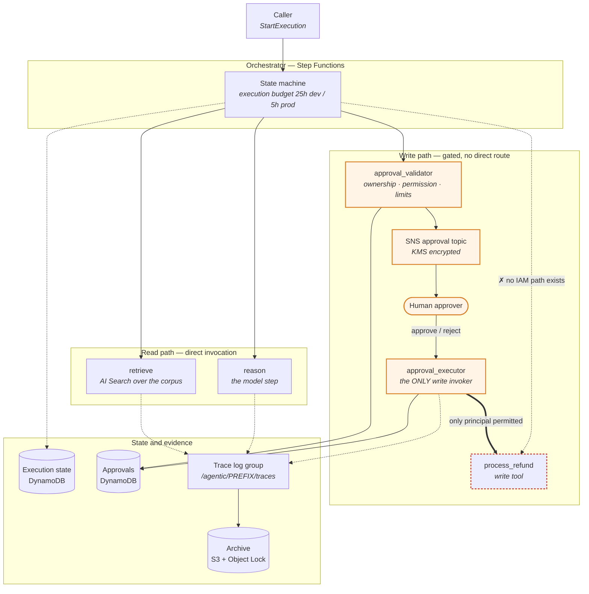
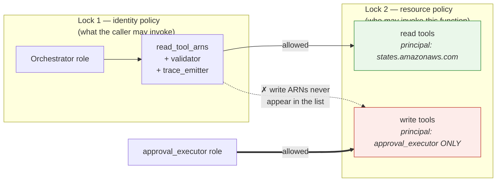
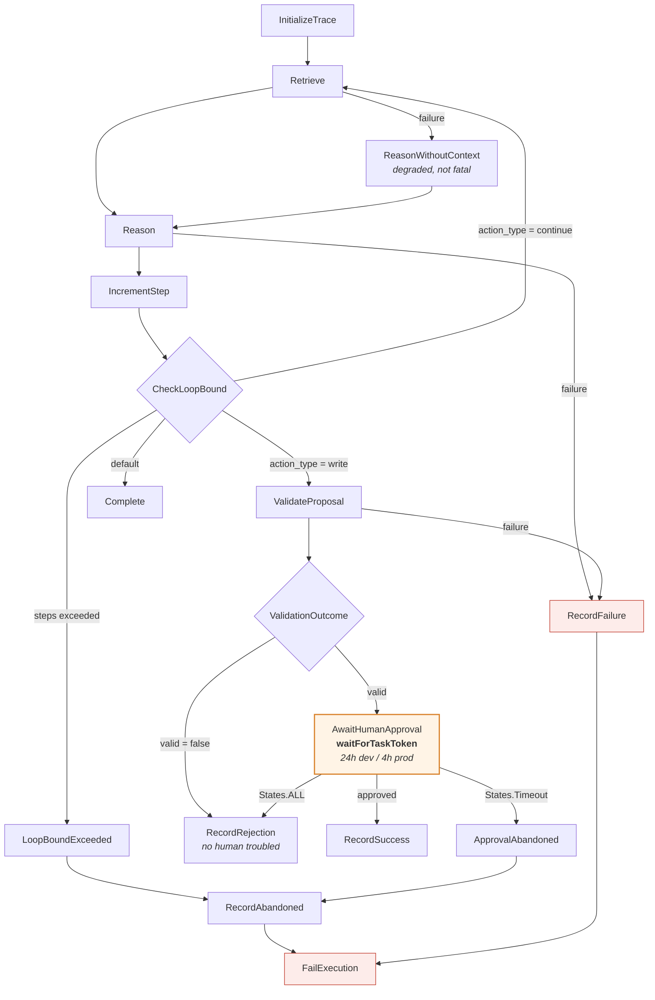
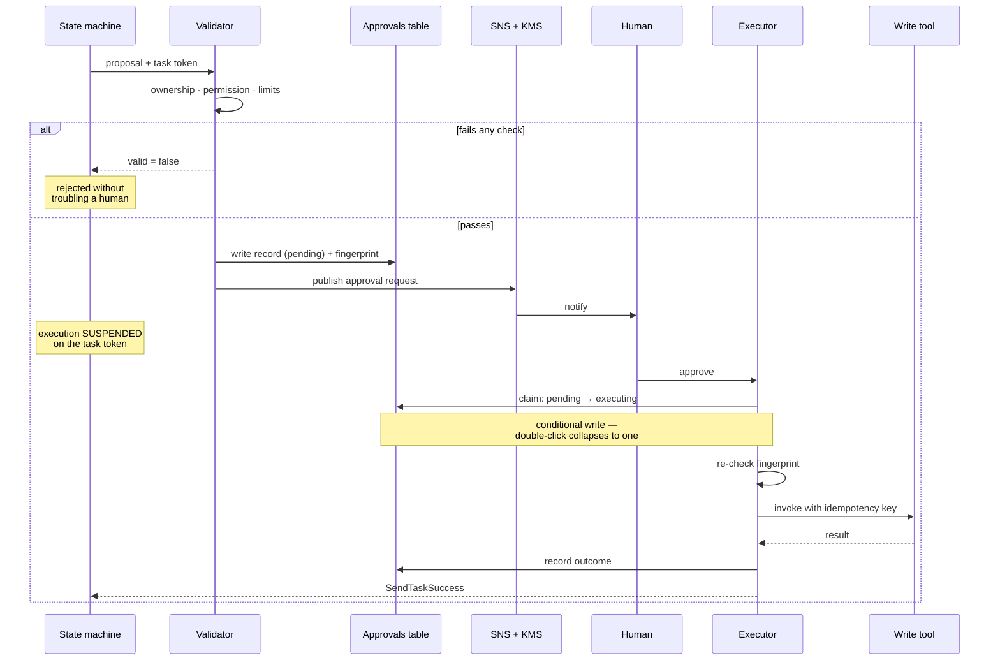
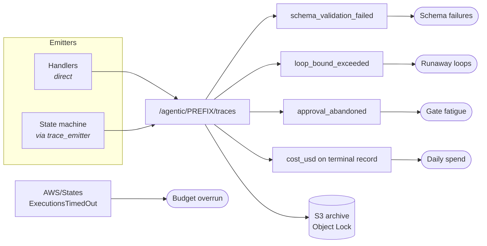
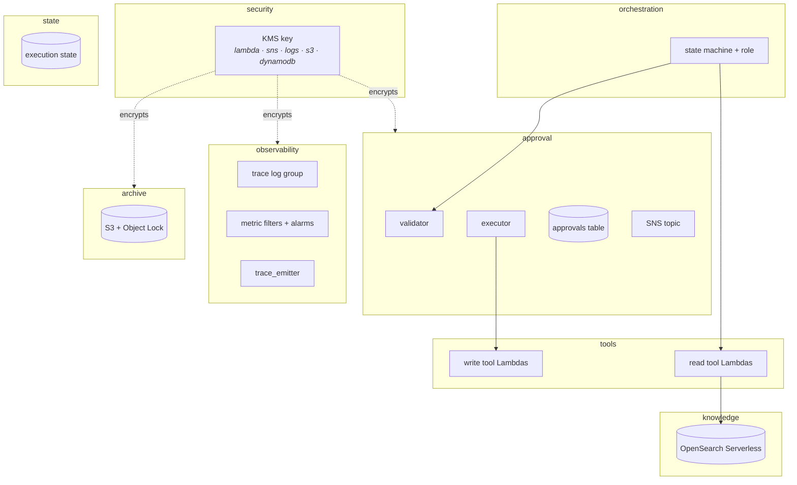

# Architecture — AWS

The claim this architecture makes is narrow and worth stating plainly:

> A state-changing action cannot reach production without a human approving that specific
> action, and that is enforced by IAM — not by the prompt, and not by the model choosing
> to behave.

Everything below exists to make that true, and to make it observable when it isn't.

---

## 1 · The whole system

Two paths leave the orchestrator. The read path is direct. The write path cannot be
walked without a human, and the boundary is drawn by IAM rather than by convention.

The dashed red edge is the point of the whole design: **there is no IAM path from the
state machine to a write tool.** Not a discouraged one — an absent one.

---

## 2 · Why the boundary holds — two independent locks

An architecture that depends on one check is one misconfiguration from being open. This
one requires both sides to agree, and neither side names the other's tools.

| Lock | Where | What it does |
|---|---|---|
| Identity policy | `modules/orchestration` | Grants `lambda:InvokeFunction` on an explicit ARN list — `read_tool_arns + validator + trace_emitter`. Write tool ARNs are never added, so there is nothing to accidentally over-grant. |
| Resource policy | `modules/tools` | `aws_lambda_permission.read_tool_from_orchestrator` names `states.amazonaws.com`; `write_tool_from_approval` names the executor. A write tool has no statement admitting the state machine. |

Remove either lock and the other still refuses. That redundancy is deliberate — no
blanket `lambda:InvokeFunction` on the account anywhere, which is the usual shortcut and
the one that turns a confused agent into lateral movement.

---

## 3 · Request lifecycle

The state machine as actually defined in `envs/*/state-machine.json.tftpl`.

Three routing decisions carry weight:

- **`CheckLoopBound` before anything else.** An agent that loops is an agent spending
  money. The bound is 12 steps in dev, 8 in prod, and exceeding it is a failure, not a
  quiet stop.
- **`ValidationOutcome` rejects before notifying.** Invalid proposals never reach a
  human. This is what keeps approval requests meaningful — a reviewer who sees mostly
  junk stops reading, and gate fatigue is how a gate fails while appearing to work.
- **`States.Timeout` is caught separately from `States.ALL`.** Nobody answering is not
  the same event as a human declining, and conflating them makes reviewer disengagement
  invisible. The catch order matters: `States.ALL` first would swallow the timeout.

---

## 4 · The approval round trip

`waitForTaskToken` is what makes the pause real. The execution is genuinely suspended —
not polling, not sleeping — and resumes only when someone resolves the token.

Two failure modes this shape defends against:

**Replay and double-click.** The claim is a DynamoDB conditional write, so a redelivered
SNS message, a retried Lambda, and an impatient reviewer all collapse into one execution.

**Argument tampering between approval and execution.** The validator fingerprints the
arguments a human was shown; the executor re-computes it before invoking. A mismatch
fails the task rather than executing something nobody approved.

**A crashed executor.** If it dies between claiming and resolving the token, the record
sits in `executing` and the execution blocks until the window closes. A claim older than
`STALE_CLAIM_SECONDS` is therefore reclaimable — safe only because the write tool is
idempotent on the approval ID, which is what that key is for.

---

## 5 · Observability

Metric filters attach to **one** log group, `/agentic/PREFIX/traces` — not to each
function's own group. A handler that only prints to stdout looks healthy in the console
and is invisible to every alarm.

A state machine writes to its *execution* log group, not the trace group, so the
orchestrator's own records — the terminal outcome, the loop bound firing — reach the
filters only through `trace_emitter`. Omit that function and the loop-bound and cost
alarms sit at zero forever, which reads exactly like a healthy system.

`cost_usd` and `total_tokens` belong on the **terminal** record only. Emitting them per
step multiply-counts spend.

---

## 6 · What Terraform builds

| Module | Creates | The load-bearing part |
|---|---|---|
| `security` | KMS key, optional Bedrock guardrail | Key policy must admit `sns.amazonaws.com`, or approval messages publish successfully and are never delivered |
| `tools` | One Lambda per tool, roles, resource policies | The `access` field drives the read/write split; roles need `kms:Decrypt` for encrypted env vars |
| `approval` | Approvals table, SNS topic, validator, executor | The executor is the only principal in write tools' resource policy |
| `orchestration` | State machine, role | ARN list excludes write tools by construction |
| `observability` | Trace log group, 4 metric filters, alarms, `trace_emitter` | Filters live on one shared group |
| `state` | Execution state table | PITR on in prod |
| `knowledge` | AI Search collection, access policies | Data access is separate from IAM — the principal must be the **retrieve tool's** role, not the orchestrator's |
| `archive` | S3 bucket, Object Lock | COMPLIANCE mode cannot be shortened by anyone, including root |

---

## 7 · Where the properties actually live

Infrastructure cannot enforce all of this. Some of it is only true if the code is right,
and it is worth being explicit about which is which.

| Property | Enforced by | If it breaks |
|---|---|---|
| Write tools unreachable without approval | **IAM** — identity + resource policy | Cannot break by editing a prompt |
| Approved arguments are what execute | **Code** — fingerprint re-check in the executor | Executes something nobody approved |
| Caller owns the resource | **Code** — `_resource_owner` in the validator | Approves a cross-tenant action |
| Retrieval is tenant-scoped | **Code** — filter inside the kNN clause, not beside it | Ranks other tenants' documents first, then hides them |
| Retries don't double-charge | **Code** — idempotency key in the write tool | A retry storm moves money twice |
| Failures are visible | **Config** — `TRACE_LOG_GROUP` + `trace_emitter` | Alarms sit at zero, indistinguishable from health |

The three `NotImplementedError` stubs sit squarely in the "Code" rows, and they raise
rather than returning a plausible default for exactly this reason. A reference
implementation that answers "yes, they own it" so the demo runs is how a stub reaches
production.
