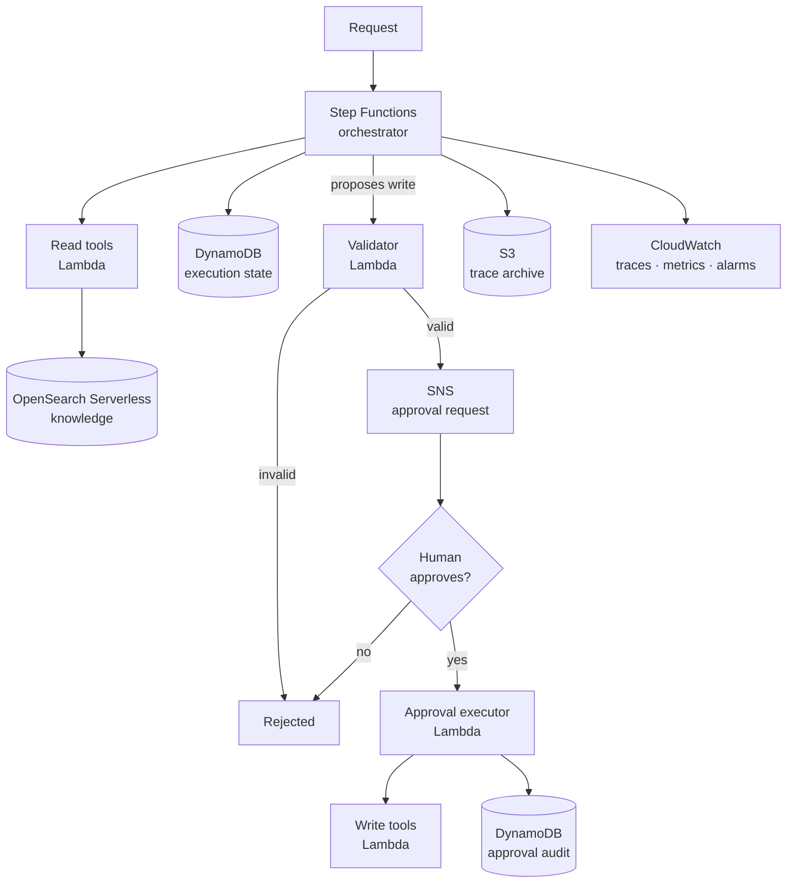

# Terraform — agentic system on AWS

A reference implementation of [agentic-system-architecture/](../../docs/agentic-system-architecture/README.md)
on AWS. Every module maps to a building block from that document, and the comments in the
`.tf` files cite the specific guidance they implement.

> **This is a reference, not a drop-in product.** The shape is opinionated and the
> defaults are defensible, but the tool definitions, the state machine, and the handler
> code are yours. Read [HOW-TO-DEPLOY.md](HOW-TO-DEPLOY.md) before applying anything, and
> work through [checklists/pre-apply.md](checklists/pre-apply.md) before prod.

---

## What this builds



**The load-bearing property:** the orchestrator can reach read tools directly and cannot
reach write tools at all. Only the approval executor can invoke a write, and only after a
human resolves the task token. That is the architecture doc's "the model proposes,
application code decides" rendered as IAM.

---

## Layout

| Path | Building block |
|---|---|
| [modules/security/](modules/security/) | KMS key, optional Bedrock guardrail |
| [modules/state/](modules/state/) | Section 3 execution state — DynamoDB |
| [modules/knowledge/](modules/knowledge/) | Section 3 knowledge memory — OpenSearch Serverless |
| [modules/archive/](modules/archive/) | Section 3 long-term archive — S3 |
| [modules/orchestration/](modules/orchestration/) | Section 4 orchestration — Step Functions |
| [modules/tools/](modules/tools/) | Section 2 tool layer — the read/write split |
| [modules/approval/](modules/approval/) | Section 6 approval gates — validator, executor, audit |
| [modules/observability/](modules/observability/) | Traces, cost and token metrics, alarms |
| [src/](src/README.md) | Reference handlers — the half of the architecture that only code can enforce |
| [envs/dev/](envs/dev/) | Cheaper, more permissive, synthetic data |
| [envs/prod/](envs/prod/) | VPC-only, PITR, no execution data in logs |

Both environments use the **same modules and the same wiring**. Only variables differ — an
approval gate exercised only in prod is a gate nobody has tested.

**Where the model layer lives.** AWS has no `model-integration/` module, unlike the Azure
and GCP trees. Bedrock model access and the guardrail are declared in `modules/security/`,
because on AWS the model layer *is* an access-control surface: there is no account resource
to create, only an IAM policy naming the model ARNs and a `aws_bedrock_guardrail` attached
to them. Azure and GCP both need a first-class account or endpoint resource, so both earn a
module. Identity is distributed the same way — each module declares the roles it needs
rather than a central `identity/` module owning them.

**Why handler dependencies carry floors, not pins.** `src/*/requirements.txt` here uses
`>=` while `examples/*/requirements.txt` was pinned to `==`
(see [docs/REPO-AUDIT.md](../../docs/REPO-AUDIT.md) task 12). The difference is deliberate.
These handlers are deployed rather than demonstrated: the Lambda runtime already ships a
boto3, and pinning a conflicting one into the package is how you get an import error that
only appears in the deployed artifact. The AWS SDKs also hold a far stronger compatibility
line than the LLM framework ecosystem, which is what made floors unsafe in the examples —
`langchain>=0.0.300` resolved to 1.3.15 and took its own imports with it.

---

## Quick start

```bash
cd src && ./build.sh && cd ..    # the zips terraform reads at plan time

cd envs/dev
cp terraform.tfvars.example terraform.tfvars
# Edit terraform.tfvars: project name, tool definitions, handler packages.

terraform init
terraform plan
terraform apply
```

The packages must exist before you plan — `filebase64sha256` reads them at plan time, so a
missing zip fails immediately rather than at apply. [src/](src/README.md) holds the
reference handlers; three functions in them raise deliberately, and that file says which.

Full walkthrough, including the state machine and what the handlers must do:
[HOW-TO-DEPLOY.md](HOW-TO-DEPLOY.md).

---

## What Terraform enforces, and what it cannot

Worth being precise about, because the gap is where incidents live.

**Enforced here:**

- Write tools are invocable only by the approval executor — IAM, not convention
- The orchestrator cannot delete from the trace archive
- Every tool has a timeout; the module rejects a definition without one
- Approval gates require a STANDARD state machine, checked at plan time
- The knowledge collection is VPC-only in prod
- Data at rest is encrypted with a customer-managed key

**Not enforceable here — application code owns these:**

- **Correct `access` classification.** A tool marked `read` that mutates state defeats the
  split, and nothing in Terraform can detect that.
- **PII masking before data reaches the model.** Terraform sets up the key and the
  guardrail; the masking happens in your handler.
- **Metadata filtering at query time.** Prevents cross-tenant leakage in retrieval. The
  collection is shared; the filter is yours.
- **Trace field emission.** The metric filters match nothing unless handlers emit the
  documented schema.
- **Ownership, permission, and limit checks.** The validator Lambda exists; what it checks
  is your code. The prompt is a hint; the code is the control.
- **Idempotency keys on writes.** Agents retry. Retries must not double-charge.

---

## Cost

The idle floor is small — DynamoDB on-demand, S3, CloudWatch, and Step Functions all cost
close to nothing without traffic. **OpenSearch Serverless is the exception:** it bills a
minimum OCU capacity continuously whether or not you query it, and that dominates the bill
in a quiet dev environment.

If dev sits unused, destroy the knowledge module rather than the whole stack:

```bash
terraform destroy -target=module.knowledge
```

Model inference is not in this stack at all and is usually the largest line item in
production. The `daily_cost_threshold_usd` alarm watches what your handlers report, which
is why emitting `cost_usd` matters.

---

## Related

- [agentic-system-architecture/](../../docs/agentic-system-architecture/README.md) — the design this implements
- [BUILDING-BLOCKS.md](../../docs/agentic-system-architecture/BUILDING-BLOCKS.md) — the six layers
- [PRODUCTION-PRINCIPLES.md](../../docs/agentic-system-architecture/PRODUCTION-PRINCIPLES.md) — reliability, cost, observability
- [AGENT-SECURITY.md](../../docs/agentic-coding-playbook/AGENT-SECURITY.md) — prompt injection and capability limits
- [ENTERPRISE-ADAPTATION.md](../../docs/agentic-coding-playbook/ENTERPRISE-ADAPTATION.md) — governed environments
