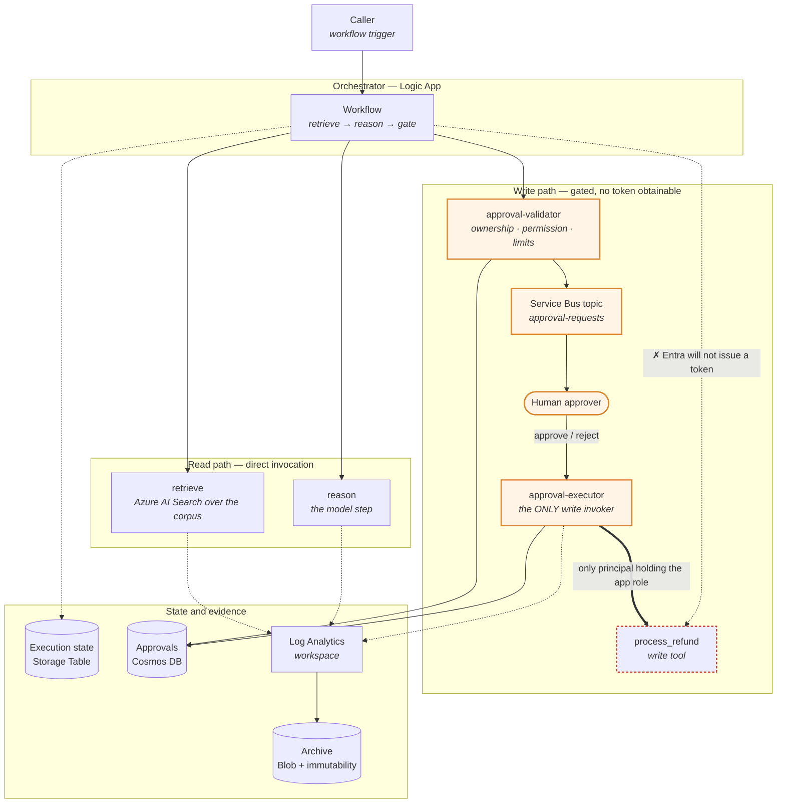
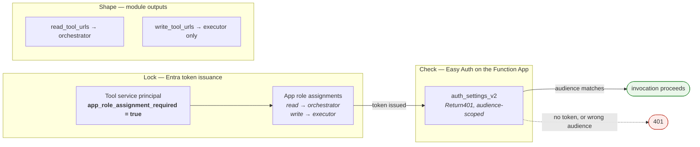
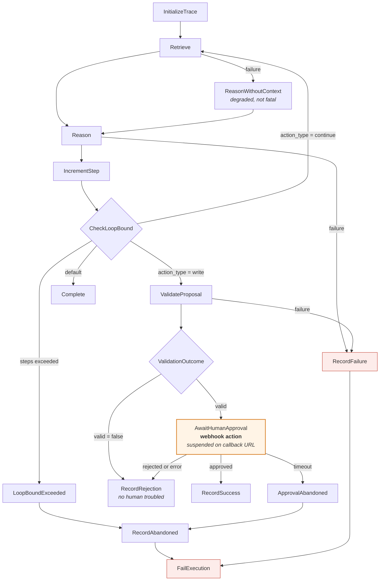
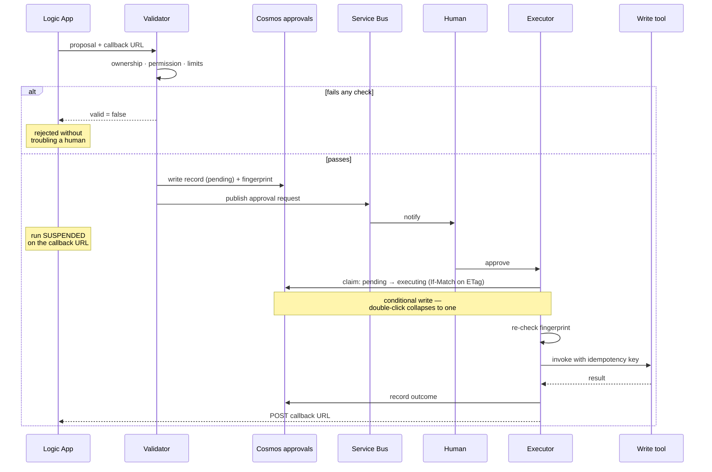
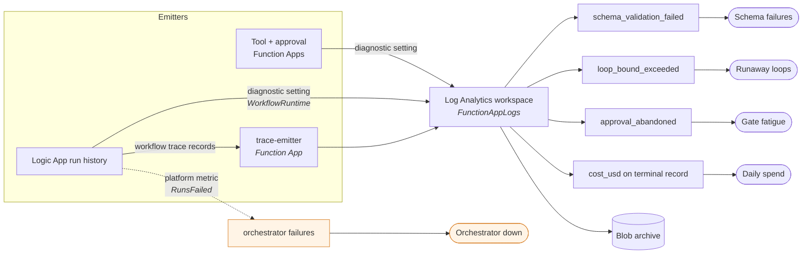
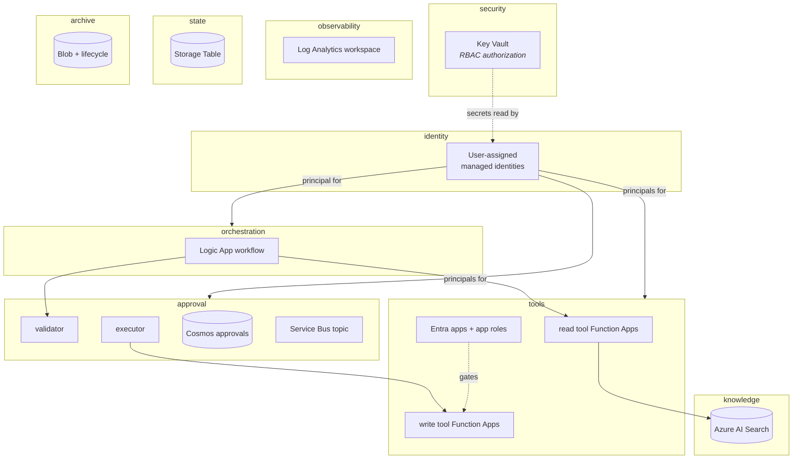

# Architecture — Azure

The claim this architecture makes is the same one the AWS tree makes:

> A state-changing action cannot reach production without a human approving that specific
> action, and that is enforced by the identity platform — not by the prompt, and not by
> the model choosing to behave.

What differs is the machinery. Azure has no equivalent of a Lambda resource policy, so
the boundary is drawn with Entra app roles instead. That substitution is not free, and
§2 is explicit about where it is weaker than the AWS original.

> **Implementation status.** The modules and both environment roots validate. The Logic
> App workflow definition, the archive immutability policy, and the observability wiring
> are now built. Two things are still absent and are marked **not yet built** where they
> appear below: the Azure handler source (`src/`), and the Azure Policy guard described in
> §2. Read those marks as literal — everything else in the diagrams exists in Terraform.

---

## 1 · The whole system

Two paths leave the orchestrator. The read path is direct. The write path cannot be
walked without a human, and the boundary is drawn by Entra rather than by convention.

The dashed red edge is the point of the whole design. On AWS it reads "no IAM path
exists." Here it is subtly different and worth saying precisely: **the orchestrator
cannot obtain a token for a write tool**, because Entra refuses to mint one for a
principal with no app role assignment on that resource.

---

## 2 · Why the boundary holds — and where it is thinner than AWS

The AWS tree has two genuinely independent locks: an identity policy listing what the
caller may invoke, and a resource policy on each function listing who may invoke it.
Remove either and the other still refuses.

Azure has no resource policy for Functions. What it has is one lock and two mitigations,
and conflating them would be the kind of comfortable mistake this document exists to
prevent.

| Layer | Where | What it actually does | Independent? |
|---|---|---|---|
| Entra app role | `modules/tools` — `app_role_assignment_required = true` plus one `azuread_app_role_assignment` per tool | Entra refuses to issue a token for this resource to any principal without an assignment | **This is the boundary.** Everything else assumes it holds |
| Easy Auth | `modules/tools` — `auth_settings_v2`, `unauthenticated_action = "Return401"` | Rejects requests with no token, or a token minted for a different audience, before handler code runs | **No.** If the Entra lock were disabled, the orchestrator could obtain a valid token for the write tool's own audience and Easy Auth would accept it |
| Output shape | `modules/tools` — `read_tool_urls` excludes write tools by construction | The orchestrator is never handed a write tool's address | **No.** A URL is not a secret and is discoverable |

**The consequence, stated plainly:** `app_role_assignment_required = true` is
single-load-bearing on Azure in a way that no single line is on AWS. Flip it to `false`
and the split becomes decorative while every diagram, output, and role assignment still
looks correct. It is called out in the module comment for that reason, and it is the
first thing to check in any review of this tree.

The honest mitigation is not another Terraform resource — it is Azure Policy denying
`app_role_assignment_required = false` on these applications, evaluated outside the
Terraform run that would be the thing making the mistake. That is not yet configured.

---

## 3 · Request lifecycle

`modules/orchestration` builds this as a Logic App workflow definition, with the actions
written as `jsonencode` blocks in Terraform rather than a separate JSON template. That is
deliberate: tool URLs are interpolated from module outputs, so a wrong name fails at plan
time instead of becoming a 404 at run time.

Three routing decisions carry the weight, and each was easy to lose in translation to a
Logic App. How they landed:

- **`CheckLoopBound` before anything else.** An agent that loops is an agent spending
  money. Exceeding the bound must be a failure, not a quiet stop.
- **`ValidationOutcome` rejects before notifying.** Invalid proposals never reach a human.
  This is what keeps approval requests meaningful — a reviewer who sees mostly junk stops
  reading, and gate fatigue is how a gate fails while appearing to work.
- **Timeout is caught separately from rejection.** Nobody answering is not the same event
  as a human declining, and conflating them makes reviewer disengagement invisible. Logic
  Apps make this easier to get wrong than Step Functions did: a webhook action's timeout
  and its failure path are configured in different places.

**Why a Logic App and not Durable Functions.** The AWS design suspends the run on a task
token — genuinely parked, with the state persisted by the platform rather than by handler
code. The only Azure primitive with that shape is a Logic App webhook action, which emits
a callback URL and waits indefinitely. Durable Functions can approximate it with an
external event, but the orchestration state then lives in a storage account the handler
code manages, which moves a correctness property out of the platform and into code that
has to be right.

---

## 4 · The approval round trip

The webhook action is what makes the pause real. The run is genuinely suspended — not
polling, not sleeping — and resumes only when someone calls the callback URL.

**Why Cosmos DB and not Table Storage.** The claim is the whole gate. It must be a
conditional write, or two executors racing on a double-clicked approve button both see
`pending` and both execute. Cosmos gives ETag / `If-Match` optimistic concurrency — the
direct analogue of DynamoDB's `ConditionExpression`. Table Storage has no equivalent, and
that single missing primitive is why the more obvious, cheaper service was rejected.

The account is set to **Strong** consistency for the same reason. The claim reads its own
write back; under eventual consistency a second executor can read a stale `pending` and
claim an already-claimed record, which is precisely the double-execution the gate exists
to prevent. Serverless throughput, though — this is an audit trail at human pace, not a
hot path.

Two failure modes this shape defends against:

**Replay and double-click.** A redelivered Service Bus message, a retried function, and an
impatient reviewer all collapse into one execution.

**Argument tampering between approval and execution.** The validator fingerprints the
arguments a human was shown; the executor re-computes it before invoking. A mismatch fails
the task rather than executing something nobody approved.

**A crashed executor.** If it dies between claiming and resolving the callback, the record
sits in `executing` and the run blocks until its window closes. A claim older than
`STALE_CLAIM_SECONDS` is therefore reclaimable — safe only because the write tool is
idempotent on the approval ID, which is what that key is for.

**Asymmetric Service Bus rights.** Only the validator holds `Azure Service Bus Data
Sender` on the topic. The executor has none: it consumes decisions, it does not
manufacture them. The subscription sets `dead_lettering_on_message_expiration` because a
silently dropped message is a run that hangs until its window closes with nobody knowing
why.

---

## 5 · Observability

`modules/observability` routes every emitter into one workspace and hangs five alert rules
off it — four KQL query rules over the trace records, and one platform metric alert.

The fifth alert is a different kind of thing and that is the point. The four query rules
read trace records, which only exist if the workflow got far enough to write one. A Logic
App that fails outright writes nothing, so the condition that most needs an alert is
invisible to every query rule. `orchestrator_failures` is therefore an
`azurerm_monitor_metric_alert` on the platform's own `RunsFailed` counter — the only
signal that survives the workflow not running.

The AWS lesson that transfers directly: **filters must watch one shared destination.** A
handler that only writes to its own function's logs looks healthy in the portal and is
invisible to every alert. On Azure the shared destination is a custom table in this
workspace, and each Function App needs an explicit diagnostic setting pointing at it —
Azure does not route function logs to a workspace by default the way it might appear to.

The AWS-side trap transfers too, in a new form. On AWS a state machine writes to its
execution log group, not the trace group, so the orchestrator's own records reach the
filters only through a `trace_emitter` function. On Azure, Logic App run history is
similarly separate: enabling diagnostics on the workflow is a distinct step from enabling
it on the Function Apps, and skipping it leaves the loop-bound and cost signals at zero —
which reads exactly like a healthy system. Both settings are wired, and the `trace-emitter`
Function App bridges workflow records into the same `FunctionAppLogs` table the query rules
read. It sits behind Easy Auth like everything else: an audit record that anyone can post
is not evidence.

Every alert query is filtered by `name_prefix`. Dev and prod can share a workspace, and
without that filter a dev run would page whoever is on call for prod.

`cost_usd` and `total_tokens` belong on the **terminal** record only. Emitting them per
step multiply-counts spend.

---

## 6 · What Terraform builds

Note the direction of the arrows out of `identity`. That module depends on nothing and
everything with a principal depends on it — which is the only reason it exists.

| Module | Creates | The load-bearing part |
|---|---|---|
| `identity` | One user-assigned managed identity per workload | Breaks the `tools ↔ approval` cycle. Azure principal IDs are server-assigned, so the AWS trick of computing ARNs in `locals` is unavailable |
| `security` | Key Vault with RBAC, per-principal `Key Vault Secrets User` | RBAC not access policies, so grants appear in subscription-wide access reviews. Purge protection on in prod |
| `tools` | One Function App, Entra app, and service principal per tool | `app_role_assignment_required = true` — see §2. Also `AzureWebJobsStorage__credential`, without which the runtime looks for a system-assigned identity these apps do not have |
| `approval` | Cosmos account, Service Bus topic, validator, executor | Strong consistency + ETag claim. Only the validator holds Data Sender |
| `orchestration` | Logic App workflow + full action definition, orchestrator identity attached | Identity must match the one `tools` granted read roles to, or every call 403s while looking correct in the portal. Every outbound call sets an explicit `audience` — omit it and the platform requests an ARM-scoped token that Easy Auth correctly refuses, which reads as a permissions bug |
| `observability` | Workspace, diagnostic settings, trace emitter, action group, 5 alert rules | Diagnostic settings are per-resource and `for_each`ed over every Function App. Miss one and it vanishes from every query with no error |
| `state` | Storage Table `executionstate` | ZRS in prod |
| `knowledge` | Azure AI Search service | Data-plane access is separate from control-plane RBAC, same trap as OpenSearch on AWS |
| `archive` | Blob container, immutability policy, versioning, lifecycle policy | Tiers to cool then archive, 7-year expiry in prod. `locked = true` in prod is irreversible — retention can be extended, never shortened |
| `networking` | Resource group, VNet, subnet | Nothing joins the subnet yet — Consumption plans cannot |
| `model-integration` | Nothing, deliberately | Azure OpenAI needs tenant enrollment Terraform cannot request |

---

## 7 · Where the properties actually live

Infrastructure cannot enforce all of this. The rows marked **Code** are only true if the
Azure handler source — which does not exist yet — is written correctly.

| Property | Enforced by | If it breaks |
|---|---|---|
| Write tools unreachable without approval | **Entra** — app role assignment required | Cannot break by editing a prompt. Can break by one Terraform attribute — see §2 |
| Approved arguments are what execute | **Code** — fingerprint re-check in the executor | Executes something nobody approved |
| Caller owns the resource | **Code** — ownership check in the validator | Approves a cross-tenant action |
| Retrieval is tenant-scoped | **Code** — filter inside the vector query, not applied after it | Ranks other tenants' documents first, then hides them |
| Retries don't double-charge | **Code** — idempotency key in the write tool | A retry storm moves money twice |
| One approval, one execution | **Cosmos** — ETag conditional claim + Strong consistency | A double-click executes twice |
| No standing credentials | **Azure** — user-assigned managed identities | Nothing to leak, rotate, or expire |
| Traces cannot be deleted early | **Blob** — container immutability policy, locked in prod | Evidence disappears before an audit asks for it |
| Failures are visible | **Config** — diagnostic settings + alert rules | Every alert sits at zero and reads as health |

The remaining gap is the `src/` tree. Four of the rows above say **Code**, and until the
Azure handlers exist those five are claims the infrastructure cannot keep on its own —
the gate is enforced, but what happens behind it is unwritten.

---

## Divergences from the AWS tree

Where the two trees are not equivalent, and why.

| Concern | AWS | Azure | Equivalent? |
|---|---|---|---|
| Write tool authorization | Identity policy **and** resource policy, independently | Entra app role only | **No** — one lock instead of two. §2 |
| Suspended execution | `waitForTaskToken` | Logic App webhook callback | Yes |
| Conditional claim | DynamoDB `ConditionExpression` | Cosmos ETag `If-Match` | Yes |
| Approval notification | SNS + KMS | Service Bus topic + subscription | Yes, with dead-lettering added |
| Encryption at rest | One customer-managed KMS key across services | Platform-managed keys | **No** — customer-managed keys need Premium tiers and are not configured |
| Archive immutability | S3 Object Lock, COMPLIANCE mode | Container immutability policy, locked in prod | Yes |
| Orchestrator | Step Functions state machine | Logic App workflow definition | Yes |
| Observability | 4 metric filters, 5 alarms | 4 KQL query rules + 1 metric alert | Yes |
| Handler source | `src/` with tests | None | **No** — not yet ported |

Two `No`s remain. The handler source is the larger one: without it the deployed Function
Apps have no code, so this tree stands up a correct boundary around an empty room. The
encryption difference is real but bounded — platform-managed keys still encrypt at rest,
they just are not the customer's to revoke.

Neither is visible from a `terraform validate`, which is the reason this table exists.
