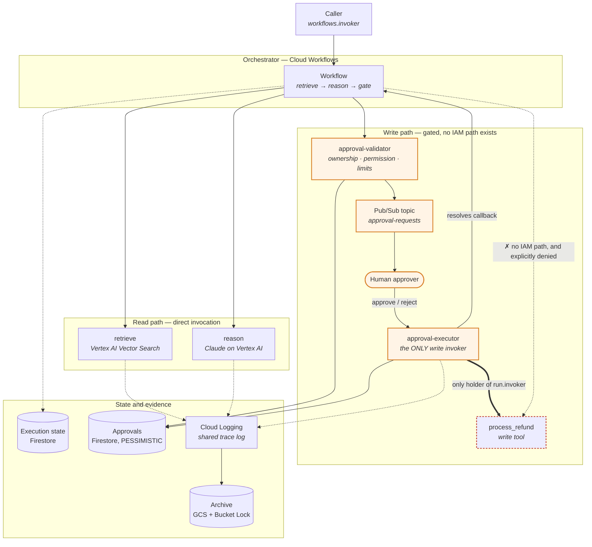
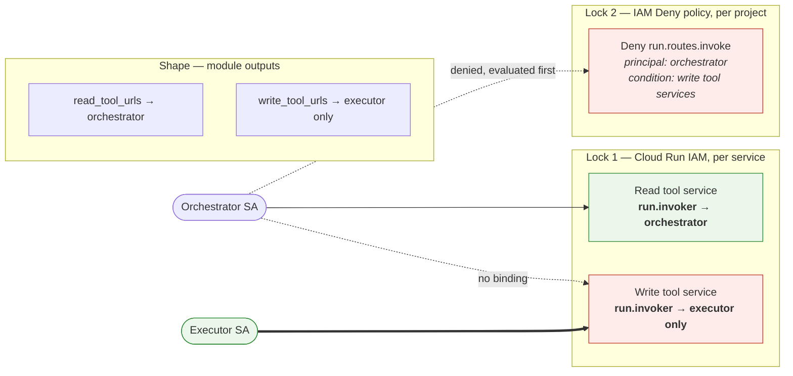
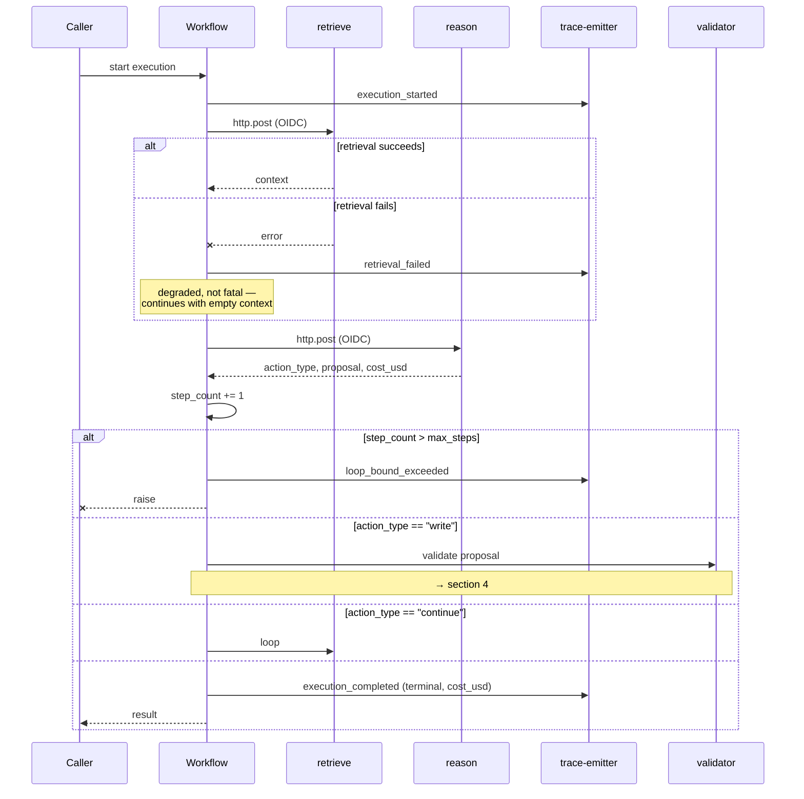
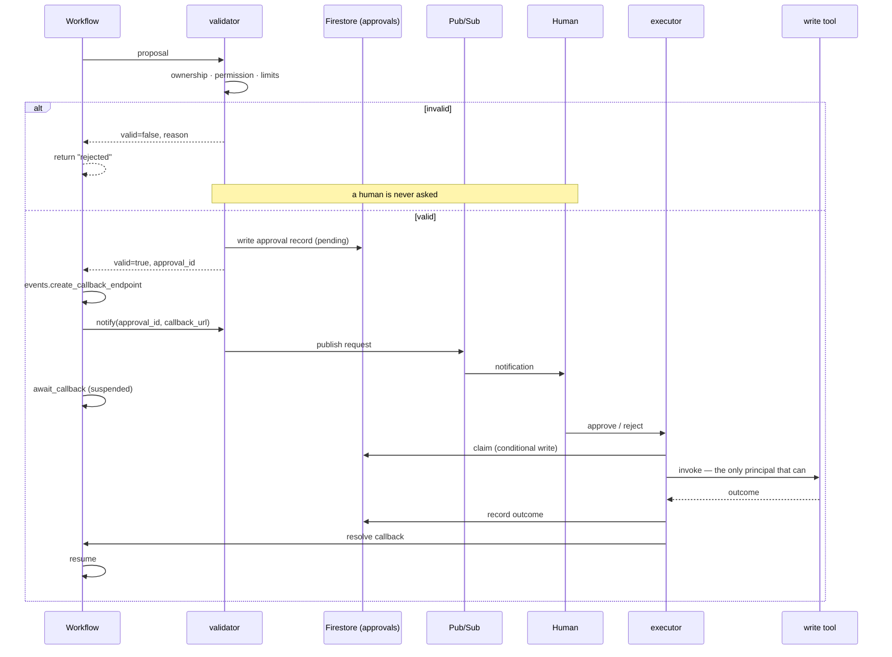
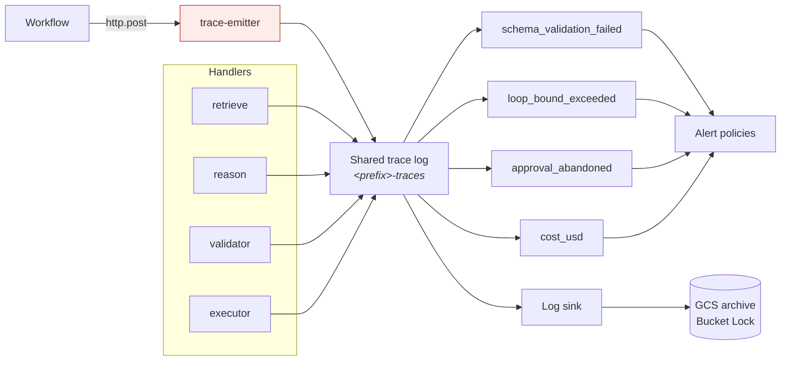

# Architecture — GCP

The claim this architecture makes is the same one the AWS and Azure trees make:

> A state-changing action cannot reach production without a human approving that specific
> action, and that is enforced by the identity platform — not by the prompt, and not by
> the model choosing to behave.

What differs is the machinery. GCP is the closest of the three to the AWS original,
because a Cloud Functions gen2 function is a Cloud Run service underneath, and a Cloud Run
service carries its own IAM policy. `roles/run.invoker` on that policy is the AWS Lambda
resource policy in different words. Section 2 is where that comparison is made precisely,
including the one place GCP is *stronger* than AWS and the one place it is weaker.

> **Implementation status.** Both roots validate: `envs/dev` and `envs/prod`. Every module
> in section 6 is built, and so is the handler source (`src/`). Everything in the diagrams
> exists in Terraform.
>
> Build the deployment packages with `src/build.sh` before planning: every `package_path`
> is read at plan time to compute a deployment hash.

---

## 1 · The whole system

Two paths leave the orchestrator. The read path is direct. The write path cannot be walked
without a human, and the boundary is drawn by Cloud IAM rather than by convention.

The dashed red edge is the point of the whole design, and on GCP it carries two
independent reasons rather than one. The orchestrator holds no `run.invoker` on that
service, *and* an IAM Deny policy names it explicitly. Either alone would refuse.

The solid edge from `executor` back to `wf` is the other thing worth noticing: the
execution is genuinely suspended while it waits, not polling. `events.await_callback`
parks it, and the executor resuming it is what moves it forward.

---

## 2 · Why the boundary holds — two independent locks

**Lock 1** is the direct AWS analogue. Each write tool's Cloud Run service policy grants
`roles/run.invoker` to the approval executor and to nobody else. This is enforced by the
same subsystem that would have to be broken to bypass it. See
[`modules/tools/main.tf`](modules/tools/main.tf).

**Lock 2** has no AWS or Azure equivalent, and it closes a gap that resource-scoped grants
alone cannot. An IAM Deny policy denies `run.googleapis.com/routes.invoke` to the
orchestrator's principal, conditioned on the write tool service names. Deny rules are
evaluated *before* allow policies, so this holds even if somebody later grants the
orchestrator a broad project-level `run.invoker` — which is exactly the accident lock 1
cannot prevent. See [`modules/orchestration/main.tf`](modules/orchestration/main.tf).

**The shape layer** is not a security control and should not be counted as one. A URL is
not a secret, and Cloud Run URLs are derivable. The orchestrator is handed
`read_tool_urls` and never `write_tool_urls` so that reaching a write tool has to be
deliberate rather than incidental.

### Where GCP is stronger than AWS

Lock 2 is the difference. AWS has two locks that are both *allow*-shaped: an identity
policy and a resource policy, each of which can be widened by someone with permission to
edit it. A deny policy cannot be overridden by a later grant. On the specific failure mode
"an operator grants a broad invoke role at the project or account level," GCP refuses and
AWS does not.

### Where GCP is weaker

Three places, and none of them is on the write path itself:

1. **Deny policies validate at apply time, not at plan time.** `terraform validate`
   passing says nothing about whether lock 2 works. An unsupported permission string is
   rejected outright at apply; a *supported but wrong* one applies cleanly, appears in the
   console, and denies nothing. Rehearse it once — HOW-TO-DEPLOY.md section 6 has the commands.
   A control nobody has seen refuse is a hypothesis, not a control.

2. **`roles/datastore.user` is project-scoped.** It covers every Firestore database in the
   project, not just the one it was granted for. AWS grants DynamoDB access per table.
   This is why the tree assumes one project per environment: there is no way to grant the
   tools access to the execution-state database without also granting it on the approvals
   database.

3. **The workflow's own invoker grant is project-scoped**, because the provider exposes no
   per-workflow IAM resource. With one orchestrator per project the practical difference is
   nil, but it is an assumption rather than an enforced property. The comment above the
   resource in `modules/orchestration/main.tf` gives the `gcloud` command that scopes it
   properly.

### The silent failure this tree guards specifically

A gen2 function has no invoker binding of its own. Granting
`roles/cloudfunctions.invoker` on the function resource looks correct, applies without
error, and does not control HTTP invocation at all.

That mistake is silent in the safe direction for read tools — they simply stop working,
loudly — and silent in the *dangerous* direction for write tools, because the write tool is
then invokable by anyone holding `run.invoker` from any other grant.

Nothing in `terraform validate` notices: it is a valid role string in a valid attribute.
[`tests/test_write_boundary.py`](tests/test_write_boundary.py) is what notices, along with
four other mistakes of the same shape. It reads the source rather than a plan, so it needs
no credentials and runs in CI.

---

## 3 · Request lifecycle

Three decisions in this diagram are load-bearing and easy to reverse by accident:

**Retrieval failure is degraded, not fatal.** Reasoning without context produces a worse
answer; refusing to reason produces none. The trace records which happened, so the two are
distinguishable after the fact rather than blending into "it worked."

**The loop bound raises rather than returning.** An execution that silently truncates looks
like a short answer, and a short answer looks like a model quality problem. Raising makes
it an incident with a metric behind it.

**Cost is emitted on the terminal record only.** The `cost_usd` log metric sums whatever it
is given and cannot tell the difference; emitting per step multiply-counts spend and the
daily budget alert fires on arithmetic rather than on money.

---

## 4 · The approval round trip

**Validation happens before notification, and the ordering is the point.** Invalid
proposals never reach a person. From the AWS tree, and it is worth repeating verbatim:

> This is what keeps approval requests meaningful — a reviewer who sees mostly junk stops
> reading, and gate fatigue is how a gate fails while appearing to work.

Gate fatigue is measured, not assumed: `approval_abandoned` fires when a window closes
unanswered, and that is a distinct event from a human declining. Conflating the two makes
reviewer disengagement invisible.

**The approvals database is `PESSIMISTIC`**, unlike the execution-state database. The
executor's claim is a read-then-conditional-write, and two executors racing on a
redelivered Pub/Sub message is the exact scenario the database exists to survive.

**The stale-claim reaper is safe only because write tools are idempotent on the approval
ID.** A claim stuck in `executing` past `STALE_CLAIM_SECONDS` may be reclaimed by another
executor. If your write tool is not idempotent, that reclaim is a double execution — and
the refund goes out twice. This is a property of your handler code and Terraform cannot
check it.

**The executor needs `roles/workflows.invoker` to resolve the callback.** Without it the
write happens and the orchestrator waits out its full timeout anyway, which reads as an
approval nobody answered — the write succeeded and every signal says it was abandoned.

---

## 5 · Observability

Every log-based metric attaches to **one** log name. From the AWS tree:

> A handler that only prints to stdout looks healthy in the console and is invisible to
> every alarm.

On GCP the trap is sharper than on AWS. Anything a Cloud Functions handler writes to
stdout is captured automatically and appears in Cloud Logging looking perfectly healthy —
but it lands in the function's own `cloudfunctions.googleapis.com/cloud-functions` log with
no structured payload. Every filter in `modules/observability` misses it and every alert
sits at zero. The logs are right there in the console, which is what makes it convincing.

**The trace emitter is why this works at all**, and it is highlighted in the diagram
because omitting it is the quiet catastrophe. A workflow cannot write to the shared trace
log: `sys.log` inside a Workflows definition writes to that workflow's own execution log,
under the Workflows resource type. So the orchestrator's own records — the terminal
outcome, the loop bound firing, the cost total — reach the metrics only by calling this
function.

Omit it and the loop-bound and spend alerts sit at zero forever, which reads exactly like a
healthy system. `modules/orchestration` refuses to plan without it, which is the only
reason that failure mode is not available here.

**Two more silent failures in this layer**, both of which return success from the caller's
point of view:

- A handler missing `roles/logging.logWriter` writes nothing and reports nothing. The
  function returns 200 and the record does not exist.
- The log sink's writer identity missing `objectCreator` on the archive bucket means the
  sink exists, reports no error, and delivers nothing. The env roots wire this explicitly;
  `sink_writer_identity` is the output that closes the loop.

---

## 6 · What Terraform builds

| Module | Builds | The thing to know |
|---|---|---|
| `identity` | One service account per workload | Created, not computed. GCP accepts an IAM binding naming a service account that does not exist — a constructed email is correct-looking and unverified. |
| `security` | KMS key ring, key, service-agent grants | Key and encrypted resources must be co-located. Four service agents, each failing at a different point in the apply. |
| `state` | Firestore execution-state database, composite index | `roles/datastore.user` is project-wide. Delete protection makes Terraform abandon rather than destroy. |
| `archive` | GCS bucket, lifecycle, Bucket Lock | `lock_retention_policy` has no default by design. Locking is irreversible by every principal including the project owner. |
| `knowledge` | Vector Search index, endpoint, deployed index, corpus bucket | Embedding dimension mismatch is accepted at create time and fails on every query. No scale-to-zero — the largest standing cost in the tree. |
| `model-integration` | Vertex AI enablement, `aiplatform.user` for the reason tool | Model Garden terms acceptance is a manual pre-step with no Terraform resource. |
| `tools` | gen2 functions, source staging, the read/write invoker split | **Lock 1.** Binds the Cloud Run service, not the function. `cloudfunctions.invoker` is the dangerous wrong answer. |
| `approval` | Approvals database, Pub/Sub, validator, executor | `PESSIMISTIC` concurrency. Executor timeout must exceed the slowest write tool. |
| `observability` | Four log metrics, alert policies, trace emitter, archive sink | The emitter is not optional in practice. Its absence is indistinguishable from health. |
| `orchestration` | Workflow, callback endpoint, IAM Deny policy | **Lock 2.** The deny policy validates at apply, not at plan. |

Environment roots: [`envs/dev`](envs/dev) and [`envs/prod`](envs/prod). They are
structurally identical — every difference is a variable, and each is annotated in
`envs/prod/main.tf` with what it costs and what it buys. An approval gate you only exercise
in prod is an approval gate you have not tested.

**Built, with one ordering constraint:** the handler source tree lives in `src/` and is
written against the Google Cloud SDKs — the AWS handlers use boto3, DynamoDB, OpenSearch,
and Step Functions task tokens, and would not run on Cloud Functions unmodified. Every
`package_path` is read at plan time to compute a deployment hash, so **run `src/build.sh`
before `terraform plan`** or the plan stops on the first missing zip.

---

## 7 · Where the properties actually live

Terraform draws the boundary. It cannot draw the properties that depend on what your code
does. Each of these is a real way to have every diagram above be accurate and the system
still be unsafe:

| Property | Enforced by | If you get it wrong |
|---|---|---|
| A tool marked `read` does not mutate state | Your handler code | The split is decorative. The model executes writes directly and every output still says the gate is intact. |
| Write tools are idempotent on the approval ID | Your handler code | The stale-claim reaper double-executes. The refund goes out twice. |
| Handlers write structured entries to `TRACE_LOG_NAME` | Your handler code | Every metric sits at zero. The console shows healthy logs the whole time. |
| Cost is emitted once, on the terminal record | Your handler code | Spend is multiply-counted and the budget alert fires on arithmetic. |
| The validator's limits match the tool's own ceiling | Two config values in two places | A proposal passes validation and the tool refuses it, or worse, neither refuses. |
| Retrieval is tenant-scoped inside the query | Your handler code | A namespace applied as a post-filter returns short result sets rather than wrong-tenant ones — which reads as poor recall, not as a leak. |
| Deny policy lock 2 actually denies | An apply-time rehearsal | You have one lock and a console entry that looks like two. |

The last row is the one to act on before the first production apply. HOW-TO-DEPLOY.md section 6
has the commands.

---

## Divergences from the AWS tree

Things that are deliberately different, so a reader comparing the two does not read them as
drift:

- **An `identity` module exists.** AWS has none — it computes ARNs in `locals` because they
  are deterministic. GCP service account emails are deterministic too, so the same trick
  would work; it is not used because GCP accepts IAM bindings to service accounts that do
  not exist, making a constructed email correct but unverified.

- **Two Firestore databases, not two DynamoDB tables in one account.** Execution state is
  `OPTIMISTIC`, approvals are `PESSIMISTIC`. Separate databases rather than separate
  collections because the concurrency mode is a database-level setting.

- **One workflow template shared by both environments.** The AWS tree keeps one state
  machine template per env root and the two have drifted in small ways that are hard to see
  in review. The parameters that differ — step ceiling, approval window — are variables.

- **`project` is validated to 10 characters**, tighter than the AWS tree's 17. The ceiling
  is the 30-character service account ID limit, and it is set by prod rather than dev
  because `prod` is a character longer than `dev`. A project name that fits in dev and not
  in prod is a failure discovered at the worst moment.

- **Lock 2 has no counterpart** in either other tree. Azure's ARCHITECTURE.md section 2 describes
  one lock and two mitigations; AWS has two allow-shaped locks; GCP has one allow and one
  deny.
