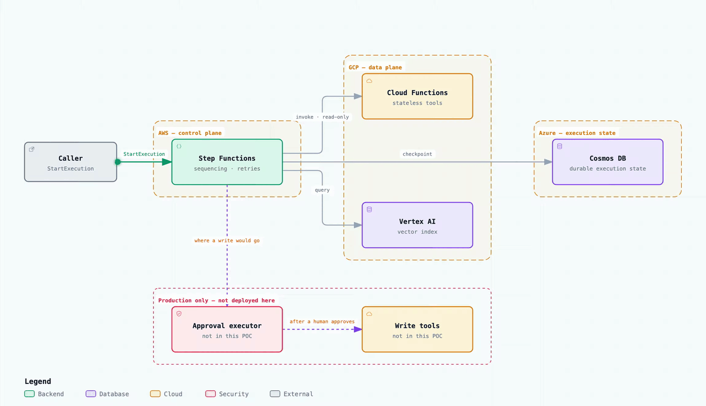

# Hybrid boundary

The proof of concept separates control-plane orchestration from data-plane tools and
state. AWS Step Functions owns sequencing and retries. GCP hosts stateless tool
functions and the vector index. Azure owns durable execution state. No module grants
one cloud credentials for another cloud.

The interactive version is [`docs/diagrams/terraform-hybrid-architecture.html`](../../docs/diagrams/terraform-hybrid-architecture.html),
and its source of truth is
[`docs/diagrams/src/terraform-hybrid-architecture.architecture.json`](../../docs/diagrams/src/terraform-hybrid-architecture.architecture.json).
The dashed lower half is the write path this POC deliberately does not deploy.

## Safety properties

- Resources are disabled by default in `envs/dev`.
- Inputs are IDs, URLs, and names; no secret values are stored in Terraform.
- The AWS state machine receives read-only tool endpoint configuration. A production
  deployment should put writes behind the same approval executor used by
  `examples/hermes-agent`.
- Cosmos DB has server-side encryption and HTTPS-only transport.
- Vertex index metadata is supplied by the caller; this POC does not upload data.

This is a topology and interface POC, not a production landing zone. Add private
connectivity, workload identities, audit sinks, retention policies, and independent
provider plans before applying it.
