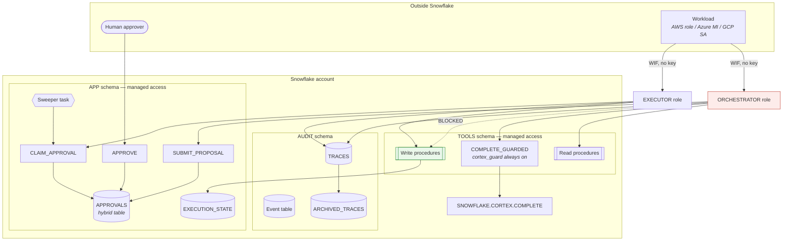
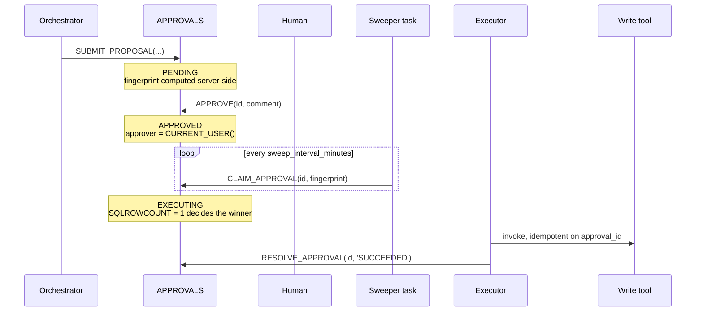

# Snowflake architecture

How this tree draws the six building blocks on a platform that has none of the primitives
the other three assume.

---

## 1 · The layers



The dotted line is the whole architecture. Everything else is arrangement.

---

## 2 · How the boundary is drawn

On the other three clouds the boundary is a single object you can point at: a Lambda
resource policy, an IAM Deny policy, an `app_role_assignment_required` flag. Here it is a
property of the role graph, which is both stronger and easier to break.

**Stronger**, because there is no policy to evaluate and no evaluation order to get wrong.
A role either holds USAGE on a procedure or it does not. There is no equivalent of the
GCP mistake where `roles/cloudfunctions.invoker` grants nothing on a Cloud Run service and
the deny silently covers no one.

**Easier to break**, because Snowflake roles inherit transitively, and inheritance is
created by a resource that mentions neither the write tool nor the boundary:

```hcl
resource "snowflake_grant_account_role" "convenience" {
  role_name        = "AGENTIC_PROD_EXECUTOR"
  parent_role_name = "AGENTIC_PROD_ORCHESTRATOR"   # one line, whole boundary gone
}
```

That grant applies without error, appears in Snowsight looking like ordinary role
management, and hands the orchestrator every write tool at once. It is why
`tests/test_write_boundary.py` walks the graph for reachability instead of checking
individual grants, and why `modules/security` deliberately does not follow Snowflake's own
SYSADMIN convention — that convention would put both roles under a common ancestor by
design.

### The three supporting properties

| Property | Where | What it stops |
|---|---|---|
| `EXECUTE AS OWNER` | every procedure | Caller privileges deciding what a tool can do |
| `with_managed_access` | `TOOLS`, `APP`, `AUDIT` schemas | An object owner granting USAGE on their own procedure, invisibly to this repo |
| Table grants to `TOOL_OWNER` only | `modules/tools` | A caller skipping the procedure and writing directly |

The middle row is the one that is easy to underrate. Without managed access, "nobody has
granted the orchestrator USAGE on a write procedure" is a claim about every grant anyone
has ever made in the account — most of which are not in this repository and are not
observable from it. With it, only the schema owner can grant, and the claim becomes a
property of a container this tree controls.

---

## 3 · The approval flow, and where it differs



**The poll is the divergence.** The other three trees suspend an execution and resume it on
a callback carrying a task token. Snowflake Tasks cannot do that, so an approved proposal
waits for the next sweep. Consequences, stated rather than buried:

- Approval latency is bounded by `sweep_interval_minutes`, not by how fast the human clicks.
- Every sweep resumes a warehouse whether or not anything is waiting.
- There is no task token, so there is no token to expire — which removes a failure mode the
  other three have and adds none.

**The claim primitive** is `UPDATE ... WHERE status = 'APPROVED'` followed by
`SQLROWCOUNT = 1`. That is a fourth spelling of the same idea as DynamoDB's condition
expression, Cosmos's ETag and Firestore's transaction, and it is exactly as strong —
provided the table is *hybrid*. A standard Snowflake table has no row-level locking and no
primary-key enforcement, so two concurrent updates to the same logical row can both report
success. The hybrid table is a correctness requirement here, not a performance choice.

**A pending approval never expires**, matching the other three trees. An `EXECUTING` claim
is reclaimable after `stale_claim_seconds` (900 by default) — a liveness window for a dead
executor, not an authorization expiry. That recovery is safe only because write tools are
idempotent on the approval ID.

---

## 4 · The guardrail, and why it is wired rather than attached

Cortex has no floor setting. AWS attaches a guardrail version to an application; GCP's
Model Armor floor setting makes filtering account-wide. On Snowflake, `cortex_guard` is an
argument to `COMPLETE` — so any caller holding `SNOWFLAKE.CORTEX_USER` can simply not pass
it, and nothing reports that.

The guard is therefore made structural:

1. `COMPLETE_GUARDED` always passes `guardrails: TRUE`.
2. `TOOL_OWNER` holds `SNOWFLAKE.CORTEX_USER` and owns the wrapper, so the wrapper works.
3. `ORCHESTRATOR` holds USAGE on the wrapper and **not** `CORTEX_USER`.

Step 3 is the wiring, and `infra/policies/guardrail_wiring.rego` fails the build if it is
undone — either by granting `CORTEX_USER` to a caller role, or by leaving the wrapper
granted to nobody, which sends callers to raw `COMPLETE` while the wrapper sits in the
schema looking like a control.

Worth being clear about what the guard does: it filters model *output*. It is not a defence
against prompt injection, and nothing on any of the four clouds is. The write boundary is
that defence; this reduces the odds of a harmful completion when nobody attacked at all.

---

## 5 · Data layout

| Object | Type | Why |
|---|---|---|
| `APP.EXECUTION_STATE` | hybrid | Single-key reads and writes; a columnar table turns each into a scan |
| `APP.APPROVALS` | hybrid | Row locking and PK enforcement — the claim's correctness depends on both |
| `APP.DOCUMENTS` | standard | Scanned in bulk by the search indexer, never updated a row at a time |
| `AUDIT.TRACES` | standard, clustered | Append-only, queried by correlation ID |
| `AUDIT.ARCHIVED_TRACES` | standard | Cold copy; short Time Travel window is the cost lever |

The trace field is `EVENT_TYPE`, matching AWS and Azure. The GCP tree calls it `event`
because Cloud Logging reserves the longer name — a divergence recorded in
[../MODULES.md](../MODULES.md) rather than papered over.

---

## 6 · Remaining work

- **No suspend-and-resume.** Snowpark Container Services could hold a long-running process
  and implement a real callback, at the cost of a compute pool that bills whenever it is
  not suspended. Left out rather than half-built.
- **No private connectivity.** Snowflake PrivateLink is an account-level purchase. The
  network allow-list in `modules/security` is what is available at no cost, and it is
  attached to the service users rather than the account so that an operator cannot be
  locked out mid-incident.
- **`snowflake_execute` for the event table.** The provider has no event-table resource at
  v2.20, so `modules/observability` uses the escape hatch — which has no drift detection.
  A hand-dropped event table produces an empty plan. The `revert` statement is populated
  properly because it is the only part of that resource that behaves.
- **No handler source tree.** The other three trees ship `src/` with validator and executor
  handlers plus tests. Here the equivalent logic lives in SQL stored procedures defined in
  `modules/approval`, so there is no separate package to build — but there is also no
  handler unit-test suite, and the CI `handlers` job does not cover this tree.
